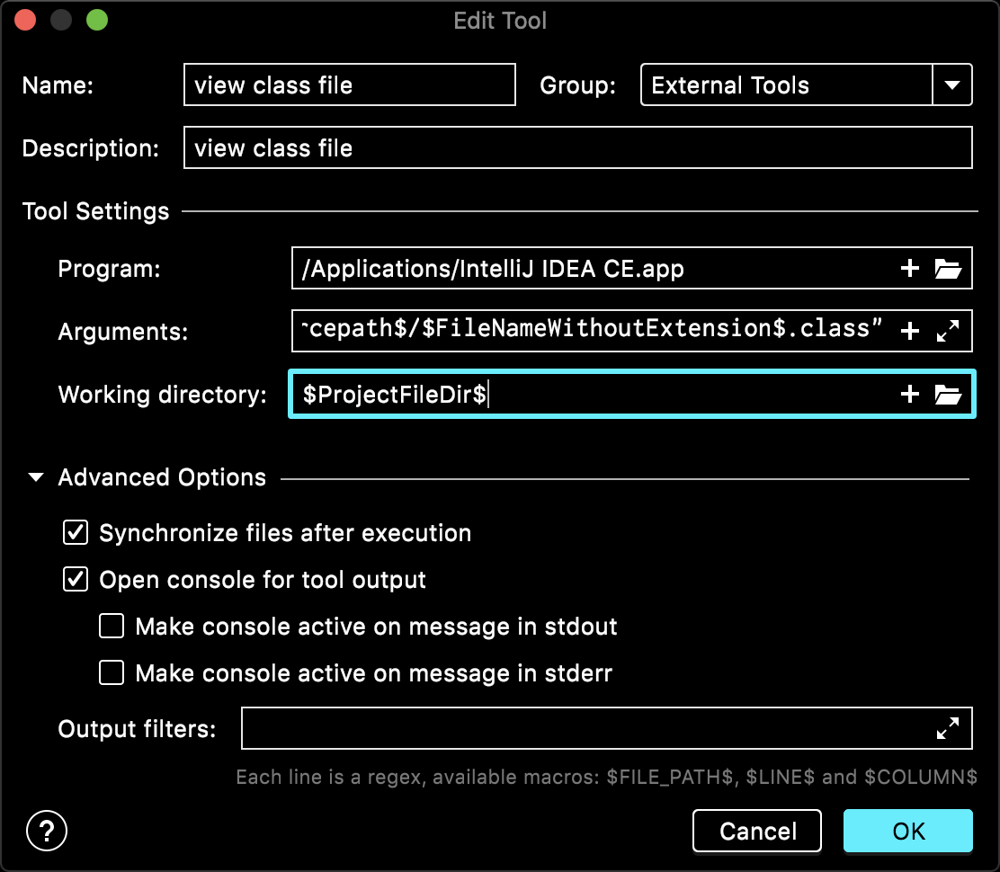

1. Alibaba Java Coding Guidelines

java代码规范

2. Lombok

消除啰嗦代码

3. bashsupport

脚本工具必备

4. markdown navigator

pytcharm下自带markdown插件有问题，容易卡死，以此替换

5. view class file

```
program: /Applications/IntelliJ IDEA.app
arguments: "$OutputPath$/$FileDirRelativeToSourcepath$/$FileNameWithoutExtension$.class"
working directory: $ProjectFileDir$
```