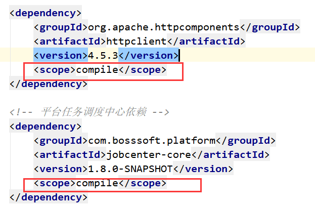

# 依赖原则
1.间接依赖路径最短优先
一个项目test依赖了a和b两个jar包。其中a-b-c1.0 ， d-e-f-c1.1 。由于c1.0路径最短，所以项目test最后使用的是c1.0。

2.pom文件中申明顺序优先
有人就问了如果 a-b-c1.0 ， d-e-c1.1 这样路径都一样怎么办？其实maven的作者也没那么傻，会以在pom文件中申明的顺序来选，如果pom文件中先申明了d再申明了a，test项目最后依赖的会是c1.1

所以maven依赖原则总结起来就两条：路径最短，申明顺序其次。

> https://blog.csdn.net/lizz861109/article/details/111594969

# 如何解决Jar冲突
遇到冲突的时候第一步要找到maven加载的到底是什么版本的jar包。通过`mvn dependency:tree`查看依赖树。
1. 遇到冲突的时候通过maven的依赖原则来调整坐标在pom文件的申明顺序是最好的办法。
2. 依赖设置为全局使用


# 如何隔离一个Jar包
1. exclusion
2. 创建一个空包
空包的坐标和你需要隔离的Jar包坐标一样，deploy的公司的私服上面。项目中这个空包申明在pom文件靠前的地方，这样依据maven依赖原则，这个空包会优先被使用，后面所有无论是直接依赖还是间接依赖的相同坐标的jar包都不会被使用了。

空包比exclusion的好处就是不用在所有间接依赖的地方去exclusion。

# INDEX.LIST
该文件由JAR工具的`-i`选项生成，包括了应用程序或者扩展中定义的包的位置。用于类加载器加速类加载过程。
> https://www.cnblogs.com/mr-bigdata/p/14407045.html#indexlist
> https://testerhome.com/articles/25207

# SpringBoot项目业务代码与库打包分离

>  https://www.baifachuan.com/posts/f1bab461.html
>  https://blog.csdn.net/abbc7758521/article/details/77987608
>  http://www.4k8k.xyz/article/sinat_39027329/114071278

```
<plugin>
    <groupId>org.springframework.boot</groupId>
    <artifactId>spring-boot-maven-plugin</artifactId>
    <version>${project.parent.version}</version>
    <configuration>
        <!--表示编译版本配置有效-->
        <fork>true</fork>
        <!--引入第三方jar包时,不添加则引入的第三方jar不会被打入jar包中-->
        <includeSystemScope>true</includeSystemScope>
        <!--排除第三方jar文件-->
        <includes>
            <include>
                <groupId>nothing</groupId>
                <artifactId>nothing</artifactId>
            </include>
        </includes>
    </configuration>
    <executions>
        <execution>
            <goals>
                <goal>repackage</goal>
            </goals>
        </execution>
    </executions>
</plugin>

<!-- 2、完成对Java代码的编译，可以指定项目源码的jdk版本，编译后的jdk版本，以及编码 -->
<plugin>
    <groupId>org.apache.maven.plugins</groupId>
    <artifactId>maven-compiler-plugin</artifactId>
    <configuration>
        <!-- 源代码使用的JDK版本 -->
        <source>${java.version}</source>
        <!-- 需要生成的目标class文件的编译版本 -->
        <target>${java.version}</target>
        <!-- 字符集编码 -->
        <encoding>UTF-8</encoding>
        <!-- 用来传递编译器自身不包含但是却支持的参数选项 -->
        <compilerArguments>
            <verbose/>
            <bootclasspath>${java.home}/lib/rt.jar:${java.home}/lib/jce.jar</bootclasspath>
        </compilerArguments>
    </configuration>
</plugin>

<!-- 3、将所有依赖的jar文件复制到target/lib目录 -->
<plugin>
    <groupId>org.apache.maven.plugins</groupId>
    <artifactId>maven-dependency-plugin</artifactId>
    <executions>
        <execution>
            <id>copy-dependencies</id>
            <phase>prepare-package</phase>
            <goals>
                <goal>copy-dependencies</goal>
            </goals>
            <configuration>
                <!--复制到哪个路径，${project.build.directory} 缺醒为 target，其他内置参数见下面解释-->
                <outputDirectory>${project.build.directory}/lib</outputDirectory>
                <overWriteReleases>false</overWriteReleases>
                <overWriteSnapshots>false</overWriteSnapshots>
                <overWriteIfNewer>true</overWriteIfNewer>
            </configuration>
        </execution>
    </executions>
</plugin>

<!-- 4、指定启动类，指定配置文件，将依赖打成外部jar包 -->
<plugin>
    <groupId>org.apache.maven.plugins</groupId>
    <artifactId>maven-jar-plugin</artifactId> <!-- 负责将应用程序打包成可执行的jar文件 -->
    <configuration>
        <archive>
            <manifest>
                <!-- 是否要把第三方jar加入到类构建路径 -->
                <addClasspath>true</addClasspath>
                <!-- 外部依赖jar包的最终位置 -->
                <classpathPrefix>lib/</classpathPrefix>
                <!-- 项目启动类 -->
                <mainClass>xxx.xxx.xxxx.XXX</mainClass>
            </manifest>
        </archive>
        <!--资源文件不打进jar包中，做到配置跟项目分离的效果-->
        <excludes>
            <!-- 业务jar中过滤application.properties/yml文件，在jar包外控制 -->
            <exclude>application.yml</exclude>
        </excludes>
    </configuration>
</plugin>

<plugin>
    <groupId>org.apache.maven.plugins</groupId>
    <artifactId>maven-antrun-plugin</artifactId>
    <executions>
        <execution>
            <id>copy-jar-file</id>
            <phase>package</phase>
            <goals>
                <goal>run</goal>
            </goals>
            <configuration>
                <target>
                    <copy todir="${project.build.directory}/config">
                        <fileset dir="${project.basedir}/src/main/resources">
                            <include name="*" />
                            <include name="*/*" />
                            <include name="*/*/*" />
                        </fileset>
                    </copy>
                </target>
            </configuration>
        </execution>
    </executions>
</plugin>
```


# Spring Boot Gradle 瘦身打包 thinJar，分离 lib jar 依赖
> https://weiku.co/article/135/

# 探究 Java 应用的启动速度优化
> https://python.iitter.com/other/168537.html


---
#mvn #java