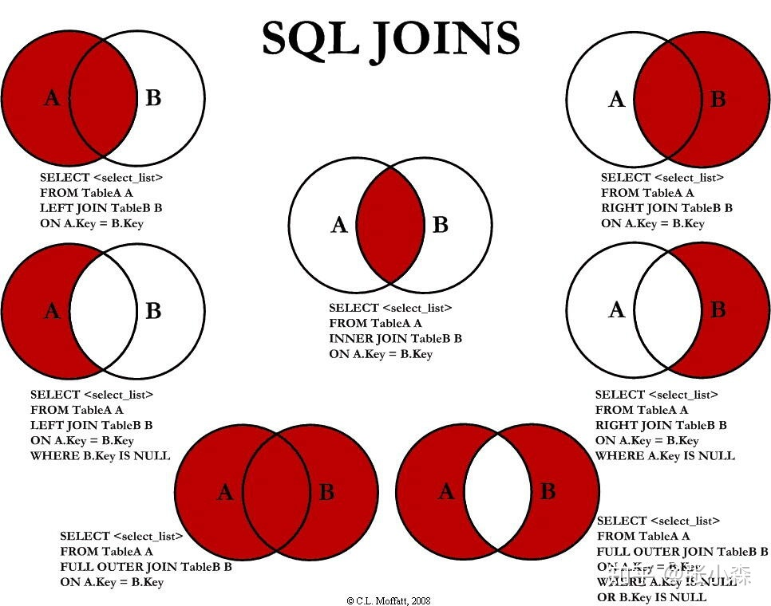
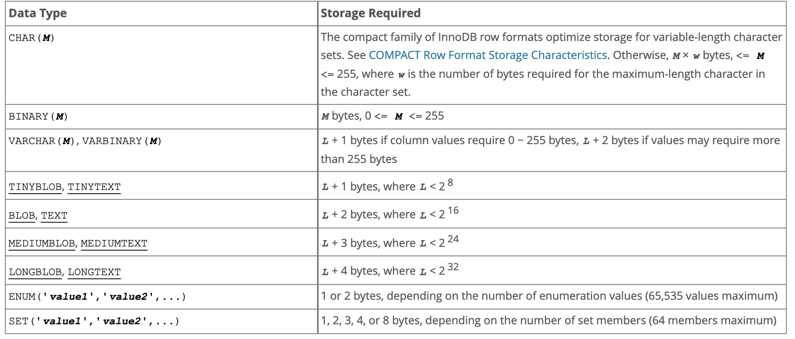

# joins




# 数据存储需求




> https://dev.mysql.com/doc/refman/8.0/en/storage-requirements.html


# 索引

通俗点讲
- 聚簇索引：将数据存储与索引放到了一块，找到索引也就找到了数据
- 非聚簇索引：将数据存储于索引分开结构，索引结构的叶子节点指向了数据的对应行，myisam通过key_buffer把索引先缓存到内存中，当需要访问数据时（通过索引访问数据），在内存中直接搜索索引，然后通过索引找到磁盘相应数据，这也就是为什么索引不在key buffer命中时，速度慢的原因

澄清一个概念：innodb中，在聚簇索引之上创建的索引称之为辅助索引，辅助索引访问数据总是需要二次查找，非聚簇索引都是辅助索引，像复合索引、前缀索引、唯一索引，辅助索引叶子节点存储的不再是行的物理位置，而是主键值。


> https://www.jianshu.com/p/fa8192853184

# 锁

> https://zhuanlan.zhihu.com/p/29150809
> https://blog.csdn.net/qq_40174198/article/details/111835482


# 常用sql和命令

- 改变表编码

  ```mysql
  alter table table_name convert to character set utf8 collate utf8_unicode_ci;
  ```

- 查看表的编码

  ```mysql
  show full columns from table_name;
  ```

- 清空数据库所有表记录

  ```bash
  mysql -N -s information_schema -e "SELECT CONCAT('TRUNCATE TABLE ',TABLE_NAME,';') FROM TABLES WHERE TABLE_SCHEMA='test'" -uroot -p123456 | mysql -f test -uroot -p123456
  ```

- 查询所有表的所有字段

  ```mysql
  SELECT
    a.table_name 表名,
    a.table_comment 表说明,
    b.COLUMN_NAME 字段名,
    b.column_comment 字段说明,
    b.column_type 字段类型,
    b.column_key 约束
  FROM
    information_schema.TABLES a
    LEFT JOIN information_schema.COLUMNS b ON a.table_name = b.TABLE_NAME
  WHERE
    a.table_schema = 'db_name' and b.COLUMN_NAME like '%contract_no%'
  ORDER BY
    a.table_name;
  
  
  SELECT
    b.TABLE_NAME 表名,
    b.COLUMN_NAME 字段名,
    b.column_comment 字段说明,
    b.column_type 字段类型,
    b.column_key 约束
  FROM
    information_schema.COLUMNS b 
  WHERE
    b.table_schema = 'db_name' and b.COLUMN_NAME like '%contract_no%'
  ORDER BY
    b.TABLE_NAME;
  ```

- 复制表结构 包括索引 分区

  ```mysql
  CREATE TABLE targetTable LIKE sourceTable;
  ```

- 只复制表结构

  ```mysql
  create table targetTable select * from sourceTable where 1=2;
  ```

- copy数据

  ```mysql
  INSERT INTO targetTable SELECT * FROM sourceTable;
  ```

- 导出成CSV

  ```mysql
  mysql -uroot -p123456 -h127.0.0.1 -P3306 test -e "SELECT rd.contract_no as 'contractNo', rd.amount as 'amount' FROM xx rd" | sed 's/\t/","/g;s/^/"/;s/$/"/;s/\n//g' > file.csv
  ```

-  导出库全表结构

  ```mysql
  mysqldump --column-statistics=0 -hhost -Pport -uuser -ppasswd -d db_name --skip-lock-tables > ddl.sql
  ```


- 查看数据库大小（单位：G）

  ```mysql
  SELECT TABLE_SCHEMA, SUM(DATA_LENGTH)/1024/1024/1024 FROM information_schema.TABLES GROUP BY TABLE_SCHEMA;
  ```


- 导入网络sql脚本

  ```mysql
  mysql -hhost -Pport -uuser -ppasswd db -e "$(wget -q -O - http://example.com/test.sql)";
  ```


- 查看隔离级别

	```
	show variables like '%tx_isolation%';
	```

- 修改事务级别

	```
	SET [SESSION | GLOBAL] TRANSACTION ISOLATION LEVEL {READ UNCOMMITTED | READ COMMITTED | REPEATABLE READ | SERIALIZABLE}
	```

- 查看表信息 
```
SHOW TABLE STATUS [FROM db_name] [LIKE 'pattern']
参数：[FROM db_name]  可选，表示查询哪个数据库下面的表信息。
　　　[LIKE 'pattern'] 可选，表示查询哪些具体的表名。
   show table status like 'tableName' \G
Name:  
    表名称
Engine:
    表的存储引擎
Version:
    版本
Row_format:
    行格式。对于MyISAM引擎，这可能是Dynamic，Fixed或Compressed。动态行的行长度可变，例如Varchar或Blob类型字段。固定行是指行长度不变，例如Char和Integer类型字段
Rows:
    表中的行数。对于MyISAM和其他存储引擎，这个值是精确的，对于innoDB存储引擎，这个值通常是估算的
Avg_row_length:
    平均每行包括的字节数 
Data_length:
    整个表的数据量(以字节为单位)
Max_data_length:
    表可以容纳的最大数据量，该值和存储引擎相关
Index_length:
    索引占用磁盘的空间大小(以字节为单位)
Data_free:
    对于MyISAM引擎，表示已经分配，但目前没有使用的空间。这部分空间包含之前被删除的行，以及后续可以被insert利用到的空间
Auto_increment:
    下一个Auto_increment的值
Create_time:
    表的创建时间
Update_time:
    表的最近更新时间
Check_time:
    使用 check table 或myisamchk工具最后一次检查表的时间
Collation:
    表的默认字符集和字符排序规则
Checksum:
    如果启用，保存的是整个表的实时校验和
Create_options:
    创建表时指定的其他选项
Comment:
    包含了其他额外信息，对于MyISAM引擎，保存的是表在创建时带的注释。如果表使用的是innodb引擎 ，保存的是InnoDB表空间的剩余空间。如果是一个视图，注释里面包含了VIEW字样。
```


---
#MySQL