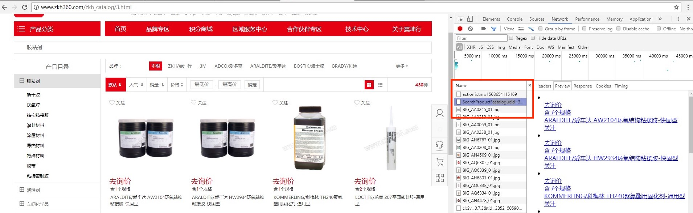
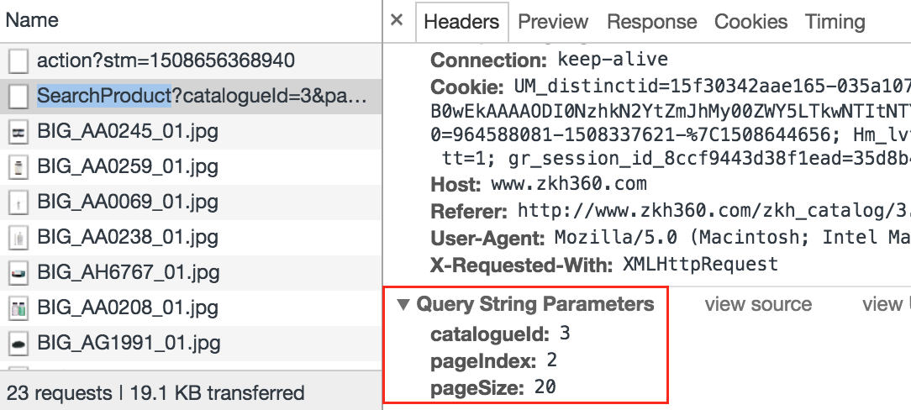
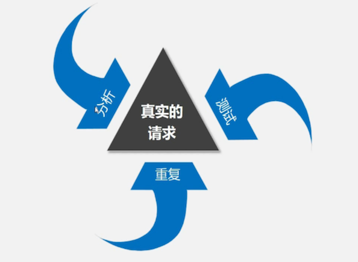
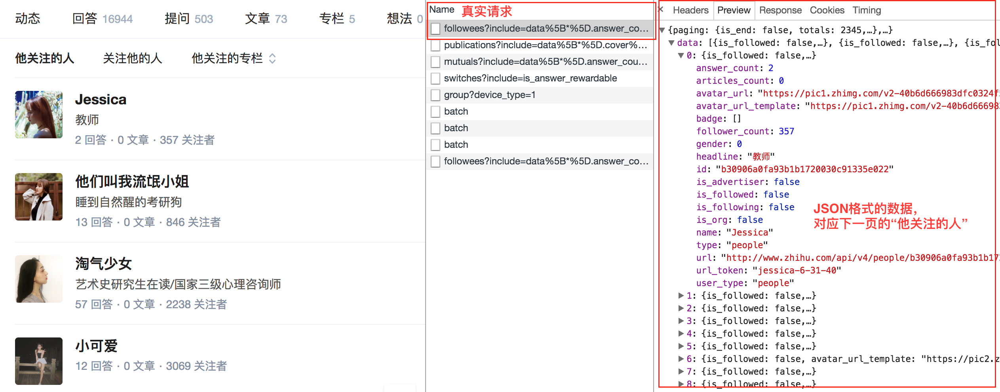
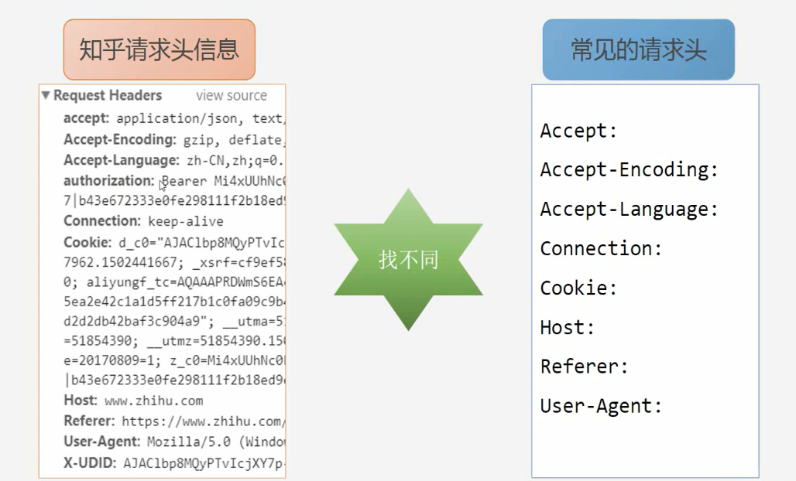
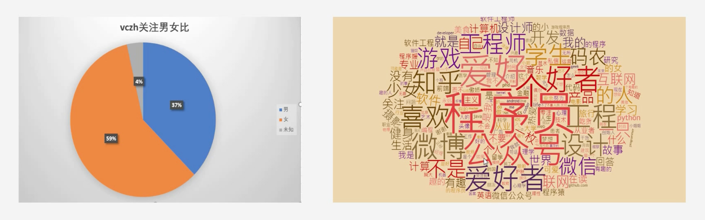

## 浏览器抓包及headers设置（案例一：爬取知乎）

首先回顾前面所学习的爬虫的一般思路和流程，再通过具体例子分析如何通过谷歌浏览器卡发着工具获取Ajax加载的网页的真实请求，解决翻页后URL不发生变化的网站爬取问题，最后通过爬取知乎的例子具体讲授这种爬取方法。

### 爬虫的一般思路

- 抓取网页、分析请求
- 解析网页、寻找数据
- 储存数据、多页处理 

本节课主要讲授如何通过谷歌浏览器开发者工具分析真实请求的方法。

### 分析具体网页请求：

1. 观察以下网址翻页后的URL：

http://www.zkh360.com/zkh_catalog/3.html

可以发现翻页后URL并没有发生变化，思考：

- 翻页后URL不变该如何寻找请求？
- 哪些网站也是如此（翻页后URL不变）？

2. 使用谷歌浏览器分析网页的真实请求

  1. 谷歌浏览器——检查——Network

  2. 首先清空请求列表，点击下一页（第2页）
  3. 在请求列表里查找真实的请求，可发现包含商品信息的真实请求为： http://www.zkh360.com/Product/SearchProduct?catalogueId=3&pageIndex=2&pageSize=20



  4. 以下是第2、3、4页的请求，通过对比可以发现网站是通过pageIndex参数控制翻页的，并且pageSize参数删去之后并不会对请求产生影响

    第2页：http://www.zkh360.com/Product/SearchProduct?catalogueId=3&pageIndex=2&pageSize=20
    第3页：http://www.zkh360.com/Product/SearchProduct?catalogueId=3&pageIndex=3&pageSize=20
    第4页：http://www.zkh360.com/Product/SearchProduct?catalogueId=3&pageIndex=4&pageSize=20

  5. 有关参数的信息可以在Hearders的Query String Parameters里查找到



  6. 翻页后URL不发生变化的网站的数据一般都是通过Ajax或者JavaScript加载的，可以在过滤器的XHR或者JS中找到真实请求

3. 寻找真实请求的三个步骤



- 分析：使用谷歌浏览器开发者工具分析网页的请求
- 测试：测试URL请求中每个参数的作用，找出控制翻页等功能的参数
- 重复：多次重复寻找符合爬虫需要的真实请求

4. 尝试寻找头条的请求

打开[今日头条](http://www.toutiao.com/)的网站，向下滚动发现网址并没有发生变化。可以通过以上所学的方法尝试查找真实的请求。

### 实战环节：爬取知乎

通过爬取知乎“轮子哥”——vczh关注的人分析Ajax或者JavaScript加载的数据的真实请求并展示这种爬取方法的具体过程。

1. 寻找真实请求的测试

首先，进入“轮子哥——vczh”关注的人的页面（注意：需要先登录个人知乎账号）

通过禁止JavaScript加载的方法发现页面不能正常加载，确认该页面的翻页是通过JavaScript加载数据实现的

使用谷歌浏览器开发者工具寻找包含关注人信息的真实请求，可以发现真实请求是以“followees”开头的请求，其返回一个JSON格式的数据，该数据对应下一页的“他关注的人”： 



双击[这个请求](https://www.zhihu.com/api/v4/members/excited-vczh/followees?include=data%5B%2a%5D.answer_count%2Carticles_count%2Cgender%2Cfollower_count%2Cis_followed%2Cis_following%2Cbadge%5B%3F%28type%3Dbest_answerer%29%5D.topics&offset=20&limit=20)，返回一个JSON格式的数据，可以通过安装JSONView插件在浏览器中更好地显示该数据

接下来便可以尝试爬取该请求的数据

2. 尝试爬取真实请求的数据

首先使用前几节课所学requests.get()尝试爬取数据

```python
# -*- coding:utf-8 -*-

import requests

url = 'https://www.zhihu.com/api/v4/members/excited-vczh/followees?include=data%5B*%5D.answer_count%2Carticles_count%2Cgender%2Cfollower_count%2Cis_followed%2Cis_following%2Cbadge%5B%3F(type%3Dbest_answerer)%5D.topics&offset=20&limit=20'
reponse = requests.get(url).text

print(response)
```

可以发现返回了“500 Server Error”，即由于网站反爬虫的原因，服务器返回了“500服务错误”

该问题可以通过添加hearders请求头信息解决

3. 添加hearders请求头信息模拟浏览器访问

请求头信息承载了关于客户端浏览器、请求页面、服务器等相关的信息，用来告知服务器发起请求的客户端的具体信息

知乎的反爬虫机制是通过核对请求头信息实现的，所以需要在使用requests请求数据的时候加上所需的请求头

对比知乎的请求头信息和常见的请求头信息，发现知乎请求头多了authorization和X-UDID的信息 



在爬虫程序中添加请求头信息，即添加headers

```python
# -*- coding:utf-8 -*-

import requests

headers = {
   'authorization':' ', #括号中填上你的authorization
   'User-Agent':' ', #括号中填上你的User-Agent
}
url = 'https://www.zhihu.com/api/v4/members/excited-vczh/followees?include=data%5B*%5D.answer_count%2Carticles_count%2Cgender%2Cfollower_count%2Cis_followed%2Cis_following%2Cbadge%5B%3F(type%3Dbest_answerer)%5D.topics&offset=20&limit=20'
response= requests.get(url, headers = headers).json()

print(response) 
```

运行程序，成功返回数据

4. 使用pandas把数据保存入库

pandas DataFrame的from_dict()方法可以很方便地把爬取到的数据保存为DataFrame格式的结构化数据 

```
# -*- coding:utf-8 -*-

import requests
import pandas as pd

headers = {
   'authorization':' ', #括号中填上你的authorization
   'User-Agent':' ', #括号中填上你的User-Agent
}
url = 'https://www.zhihu.com/api/v4/members/excited-vczh/followees?include=data%5B*%5D.answer_count%2Carticles_count%2Cgender%2Cfollower_count%2Cis_followed%2Cis_following%2Cbadge%5B%3F(type%3Dbest_answerer)%5D.topics&offset=20&limit=20'
response= requests.get(url, headers = headers).json()['data'] #添加上['data']是因为关注人的信息是保存在data下面的，只需要这一部分的数据

df = pd.DataFrame.from_dict(response)
df.to_csv('user.csv')
```

5. 定义函数实现翻页爬取

定义一个get_user_data()函数，实现翻页爬取功能，并添加上爬取时间间隔以免由于爬取太频繁给服务器造成负担 

```python
# -*- coding:utf-8 -*-


import requests
import pandas as pd
import time

headers = {
    'authorization':' ', #括号中填上你的authorization
    'User-Agent':' ', #括号中填上你的User-Agent
}

user_data = []
def get_user_data(page):
    for i in range(page):
        url = 'https://www.zhihu.com/api/v4/members/excited-vczh/followees?include=data%5B*%5D.answer_count%2Carticles_count%2Cgender%2Cfollower_count%2Cis_followed%2Cis_following%2Cbadge%5B%3F(type%3Dbest_answerer)%5D.topics&offset={}&limit=20'.format(i*20)
        response = requests.get(url, headers=headers).json()['data']
        user_data.extend(response) #把response数据添加进user_data
        print('正在爬取第%s页' % str(i+1))
        time.sleep(1) #设置爬取网页的时间间隔为1秒

if __name__ == '__main__':
    get_user_data(10)
    df = pd.DataFrame.from_dict(user_data)
    df.to_csv('users.csv')
```

6. 对数据进行分析和可视化

可以对所爬取到的“轮子哥”关注的人的信息进行数据分析，比如“轮子哥”关注的人的男女比例，或者把个人简介形成词云图等(jieba分词，wordcloud生成词云) 



### 课后作业

- 分析今日头条的翻页方法
- 将vczh改成其他人进行爬取
- 尝试爬取知乎粉丝信息

### 补充知识

1. JSON

- JSON是一个轻量级的数据交换格式，连接API进行数据爬取的时候，数据的一般返回格式为JSON。
- JSONView插件：前往[Chrome JSONView插件安装](http://www.cnblogs.com/cssfirefly/p/4368020.html)，下载并安装JSONView插件，使JSON格式的数据在谷歌浏览器中更好地呈现

2. HTTP请求

- HTTP请求方法：阅读[HTTP请求方法](http://www.runoob.com/http/http-methods.html)，学习HTTP的GET和POST请求方法，了解其它请求方法
- HTTP Hearders：阅读[HTTP响应头和请求头信息对照表](http://tools.jb51.net/table/http_header)，了解请求头和响应头的概念以及每个Header所代表的具体含义
- Headers模拟登录知乎：阅读[爬虫入门到精通-headers的详细讲解（模拟登录知乎）](https://zhuanlan.zhihu.com/p/25711916)，学习具体使用Headers模拟登录的方法
- 更多关于requests headers的用法，可以查阅[requests的官方文档](http://docs.python-requests.org/zh_CN/latest/user/quickstart.html#id6)
