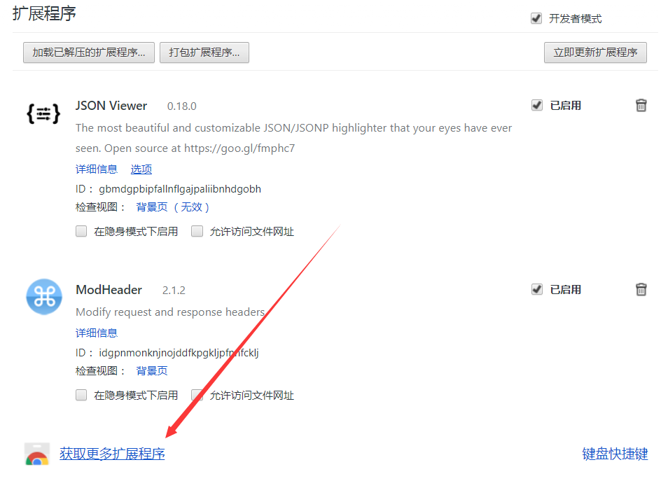
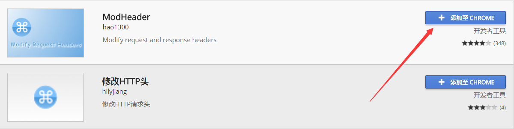
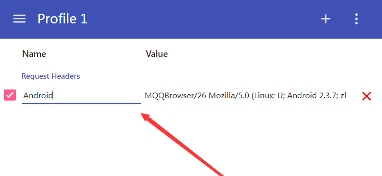

## 数据入库之MongoDB（案例二：爬取拉勾）

本节课程的内容是MongoDB数据库及其界面化工具RoboMongo的安装和基本使用，并且通过爬取拉勾的例子讲授如何通过pymongo包把爬取到的数据存储在MongoDB数据库中。

### MongoDB

#### 什么是MongoDB

MongoDB是一个高性能，开源，无模式的文档型数据库
MongoDB将数据存储为一个文档，数据结构由键值(key=>value)对组成

#### MongoDB相关的安装

1. Windows的安装方法

  1. 小歪老师在自己的知乎专栏[MongoDB及可视化工具的安装](https://zhuanlan.zhihu.com/p/29986675)中给出了详细的MongoDB数据库、可视化工具RoboMongo和MongoDB的PyCharm插件——Mongo Plugin的安装步骤和方法，可按照步骤安装并测试连接

  2. Python用于操作MongoDB的第三方库pymongo安装：

    `pip install pymongo`

2. Mac OS的安装方法：

  1. 参考[Mac OSX 平台安装 MongoDB](http://www.runoob.com/mongodb/mongodb-osx-install.html)安装，可视化工具RoboMongo安装方法与Windows平台大致相同。
  2. MongoDB的PyCharm插件——Mongo Plugin安装： Preferences——Plugins——Mongo Plugin，安装完成后重启PyCharm可发现右侧有Mongo Explorer
  3. Python用于操作MongoDB的第三方库pymongo安装

    `pip install pymongo`

  4. 测试连接

    ```
    首先需要使用以下方法在终端启动MongoDB
    cd /usr/local/mongodb/bin
    sudo ./mongod
    然后在PyCharm右侧的Mongo Explorer连接localhost：27017即可
    ```

3. MongoDB在Python中的基本使用

  通过一个简单的例子展示使用pymongo连接MongoDB数据库，并插入数据

    ```Python
    #! /usr/bin/env python
    # -*- coding:utf-8 -*-
    from pymongo import MongoClient
    client = MongoClient()
    db = client.test #连接test数据库，没有则自动创建
    my_set = db.set #使用set集合，没有则自动创建
    my_set.insert({'name':'Vinie','age':24})#插入一条数据
    ```

    插入的数据可在MongoDB的test数据库的set集合中找到


### 实战环节

爬取拉勾网有关“爬虫”的职位信息，并把爬取的数据存储在MongoDB数据库中

1. 首先前往[拉勾网“爬虫”职位相关页面](https://www.lagou.com/jobs/list_%E7%88%AC%E8%99%AB?labelWords=&fromSearch=true&suginput=)
2. 确定网页的加载方式是JavaScript加载
3. 通过谷歌浏览器开发者工具分析和寻找网页的真实请求，确定真实数据在`position.Ajax`开头的链接里，请求方式是`POST`
4. 使用requests的post方法获取数据，发现并没有返回想要的数据，说明需要加上`headers`
5. 加上headers的`Cookie`，`User-Agent`，`Referer`等信息，成功返回数据
6. 再把返回的对应数据存储到MongoDB


1. 爬取单页数据

```python
#! /usr/bin/env python
# -*- coding:utf-8 -*-

from pymongo import MongoClient
import requests

client = MongoClient()
db = client.lagou #创建一个lagou数据库
my_set = db.job #创建job集合

url = 'https://www.lagou.com/jobs/positionAjax.json?needAddtionalResult=false&isSchoolJob=0'
payload = {
    'first':'true',
    'pn':'1',
    'kd':'爬虫',
}

headers = {
    'Cookie':'',
    'User-Agent':'',
    'Referer':'',
} #填入对应的headers信息

response = requests.post(url, data = payload, headers = headers) #使用POST方法请求数据，加上payload和headers信息
my_set.insert(response.json()['content']['positionResult']['result']) #把对应的数据保存到MOngoDB
```

2. 爬取多页数据

定义一个函数爬取多页的数据；使用`fake-Agent`包随机选取`User-Agent`

```python
#! /usr/bin/env python
# -*- coding:utf-8 -*-

import requests
from pymongo import MongoClient
import time
from fake_useragent import UserAgent

client = MongoClient()
db = client.lagou
lagou = db.PHP #创建PHP集合

headers = {
            'Cookie':'',
            'Referer':'',
        } #对应的headers信息

def get_job_info(page, kd): #加入一个职位参数kd
    for i in range(page):
        url = 'https://www.lagou.com/jobs/positionAjax.json?needAddtionalResult=false&isSchoolJob=0'
        payload = {
            'first': 'true',
            'pn': i,
            'kd': kd,
        }

        ua = UserAgent()
        headers['User-Agent'] = ua.random #使用fake-Agent随机生成User-Agent，添加到headers
        response = requests.post(url, data=payload, headers=headers)

        if response.status_code == 200:
            job_json = response.json()['content']['positionResult']['result']
            lagou.insert(job_json)
        else:
            print('Something Wrong!')

        print('正在爬取' + str(i+1) + '页的数据...')
        time.sleep(3)

if __name__ == '__main__':
    get_job_info(3, 'PHP') #爬取前3页的PHP职位信息
```

### 课后作业

- 安装MongoDB、RoboMongo可视化工具、Mongo Plugin插件、pymongo包
- 尝试爬取多个职位数据
- 改进爬虫，爬取详情页数据

### 补充资料
1. MongoDB

  前往[MongoDB 3.4 中文文档](http://www.mongoing.com/docs/index.html)，学习更多关于MongoDB语法的知识
  可以在Github的[PyMongo](https://github.com/mongodb/mongo-python-driver)中学习到更多pymongo包的用法

2. POST请求

  阅读[更加复杂的 POST 请求](http://cn.python-requests.org/zh_CN/latest/user/quickstart.html#post)，学习关于requests的POST请求方法的用法

3. fake-useragent包

  前往[fake-useragent 0.1.7官方文档](https://pypi.python.org/pypi/fake-useragent)学习更多fake-useragent的用法

4. 爬取微博热点评论

ModeHeader是很好的测试httpheader，支持在线修改http header的小工具。我们可以用它来模拟移动端的Request Headers。下面将为大家展示如何添加此扩展程序。

使用Chrome浏览器，访问扩展程序:chrome://extensions/,点击获取更多扩展程序。（注意这里需要翻墙）



搜索ModHeader

Alt text


点击添加至Chrome



右上角点开它，添加名字和User-Agent



接下来就可以用它去爬取移动端的应用数据了。
下面是爬取手机端的微博热评数据，大家可以参考一下。

```python
import pymongo
import requests
import pandas as pd

class weibo:
    def __init__(self):
        # 初始化爬取条数
        self.count = 0

        #实例化mongo client连接对象
        # client = pymongo.MongoClient('127.0.0.1', 27001)
        # self.coll = client['spider']['weibo']
    def write_mongo(self,item):
        '''将item写入数据库中'''
        self.coll.update({'id': count},{'$set': item}, upsert=True)
        print ('已入库：', self.count, '条。')
        self.count += 1

    def write_file(self, item):
        '''将item写入到文件中'''

        # 写入文件
        df = pd.DataFrame.from_dict(item,orient='index')
        df.to_csv('./weibo.csv')

    def get_info(self):
        comment = {}
        for i in range(1,11):
            url = 'https://m.weibo.cn/single/rcList?format=cards&id=4160547165300149&type=comment&hot=1&page={}'.format(i)
            #创建Headers，cookie和user_agent需要换成自己的
            headers = {
                'Cookie':'_T_WM=a759aca8fd5fd4e20cbf876930d6ee91; H5_wentry=H5; backURL=https%3A%2F%2Flogin.sina.com.cn%2Fsso%2Flogin.php%3Furl%3Dhttps%3A%2F%2Fm.weibo.cn%2F%26_rand%3D1509006100.3267%26gateway%3D1%26service%3Dsinawap%26entry%3Dsinawap%26useticket%3D1%26returntype%3DMETA%26sudaref%3D%26_client_version%3D0.6.26; SCF=Aoy6fc80dcpiX-IQbgAI9tL-MQ91qWXakLPbJUlZgUbpCQaX3yqGci9_RUtAh6HGAhJukUqNqn5Cw28oR5h00t8.; SUB=_2A2509dQuDeRhGeNN61UT-S7LyDWIHXVUGfxmrDV6PUJbktBeLWnykW0W2p_Y0olCbF4MlLyQ_ooUjClbyg..; SUBP=0033WrSXqPxfM725Ws9jqgMF55529P9D9W5TIMn1sFAPOAnJGH2adIyi5JpX5K-hUgL.Fo-0ehME1K5Ne0.2dJLoI7feIgUQUGUDUs4LMNSk; SUHB=0rr76wcx9aInWq; H5:PWA:UID=1',
                'Host':'m.weibo.cn',
                'qq':'MQQBrowser/26 Mozilla/5.0 (Linux; U; Android 2.3.7; zh-cn; MB200 Build/GRJ22; CyanogenMod-7) AppleWebKit/533.1 (KHTML, like Gecko) Version/4.0 Mobile Safari/533.1',
                'referer':'https://m.weibo.cn/single/rcList?id=4160547165300149&type=comment&hot=1&tab=1',
                'Upgrade-Insecure-Requests':'1',
                'User-Agent':'Mozilla/5.0 (Windows NT 6.3; WOW64) AppleWebKit/537.36 (KHTML, like Gecko) Chrome/61.0.3163.100 Safari/537.36',
            }
            res = requests.get(url,headers = headers,verify = False).json()
            #选取名字和评论，生成字典
            for index in range(len(res[-1]['card_group'])):
                comment[res[-1]['card_group'][index]['user']['screen_name']] = res[-1]['card_group'][index]['text']

                self.count += 1
                print('已爬取：', self.count, '条。')
        #调用写文件函数，写进文件
        self.write_file(comment)
        #调用数据库函数，写进MongoDB数据库
#       self.write_mongo(comment)
if __name__ == '__main__':
    # 实例化weibo类，生成wb实例
    wb = weibo()
    # 调用get_info方法
    wb.get_info()
```
