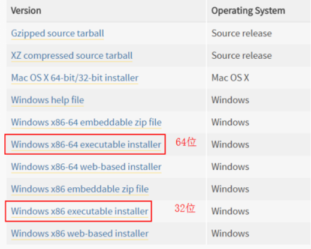
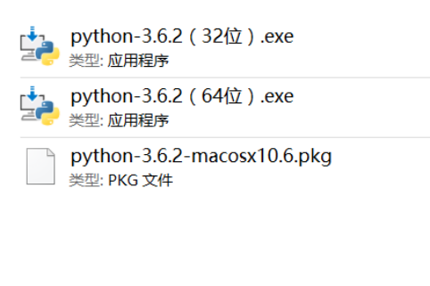

## 初识Python爬虫

### 环境搭建

#### Python2与Python3的差异

python2与python3整体差异不大，大多是一些语法上的区别，考虑到python2只会维护到2020年，因此这里建议使用python3来作为我们的编程环境。阅读[应该学习最新版本的 Python 3 还是旧版本的 Python 2？](https://www.zhihu.com/question/24549965)，了解两者之间的差别。

#### 下载Python： 
进入https://www.python.org/downloads/release/python-362/ 
下载python3.6.2版本即可。注意，最好是64位的版本（除非你的电脑是32位的）。



网速不好的同学可以直接在这里下载：http://pan.baidu.com/s/1kVsWdE3



安装过程的话只需要默认安装即可。安装完成后在cmd命令行输入python，然后回车，如果成功进入python并返回python的版本信息(我这里是3.5版本，你安装的是哪个版本就会返回哪个版本的信息)，即表示python安装成功了。

#### 其他工具下载：

chrome浏览器：下载地址：https://www.google.cn/chrome/browser/desktop/index.html 
(网速慢的可以直接在这里下载：http://pan.baidu.com/s/1bp2GgDh)

chrome浏览器插件推荐：https://www.zhihu.com/question/20054116

PyCharm编译器：下载地址：http://www.jetbrains.com/pycharm/download/#section=windows 
(网速慢的可以直接在这里下载：http://pan.baidu.com/s/1i4EzyGt)

### 创建第一个实例

urllib包：阅读[urllib官方文档](https://docs.python.org/3/library/urllib.html)，了解python自带urllib库的用法

使用urllib包获取百度首页信息：

```python
import urllib.request
#导入urllib.request

f = urllib.request.urlopen('http://www.baidu.com/')
#打开网址，返回一个类文件对象

f.read(500)
#打印前500字符

f.read(500).decode('utf-8')
#打印前500字符并修改编码为utf-8
```

Requests包：由于requests是python的第三方库，因此首先需要安装requests库，阅读[安装 Requests](http://docs.python-requests.org/zh_CN/latest/user/install.html#install),了解如何快速安装requests库； 
然后阅读[快速上手Requests](http://docs.python-requests.org/zh_CN/latest/user/quickstart.html)，了解python第三方库Requests的用法

使用Requests库获取百度首页信息：

```python
import requests      #导入requests库

r = requests.get('https://www.baidu.com/')
#使用requests.get方法获取网页信息

r
r.text      #打印结果

r.encoding='utf-8’       #修改编码

r.text        #打印结果
```

### 爬虫三步走

1. 爬虫第一步：使用requests获得数据：
	1. 导入requests 
	2. 使用requests.get获取网页源码

```
import requests      
r = requests.get('https://book.douban.com/subject/1084336/comments/').text
```

2. 爬虫第二步：使用BeautifulSoup4解析数据： 
	1. 导入bs4 
	2. 解析网页数据 
	3. 寻找数据 
	4. for循环打印

```
from bs4 import BeautifulSoup
soup = BeautifulSoup(r,'lxml')
pattern = soup.find_all('p','comment-content')
for item in pattern:
    print(item.string)
```

3. 爬虫第三步：使用pandas保存数据： 
	1. 导入pandas 
	2. 新建list对象 
	3. 使用to_csv写入

```
import pandas
comments = []
for item in pattern:
    comments.append(item.string)    
df = pandas.DataFrame(comments)
df.to_csv('comments.csv')
```

完整的爬虫

```
import requests     
r = requests.get('https://book.douban.com/subject/1084336/comments/').text

from bs4 import BeautifulSoup
soup = BeautifulSoup(r,'lxml')
pattern = soup.find_all('p','comment-content')
for item in pattern:
    print(item.string)

import pandas
comments = []
for item in pattern:
    comments.append(item.string)    
df = pandas.DataFrame(comments)
df.to_csv('comments.csv')
```


PS：
本课程所用到的代码均可在小歪老师的GitHub上查阅或下载，地址如下： 
https://github.com/zhangslob

### 补充资料：Python入门操作手册

学习好Python基础对于学习Python爬虫具有事半功倍的效果。就像开车一样，一个对开车一概不通的人看完别人开车，自己也能开，但是要把车开好不至于时不时掉沟里，好好学习开车的基本操作是非常必要的。

相信学习完第二节课，你已经安装好Python以及搭建好运行环境了。在下一节课开始之前，你需要先花几天的时间去了解和学习Python的基础知识。这会让你在接下来的Python爬虫学习中拥有一马平川的通畅。

Life is short, use Python. 这句在工业界经久不息流传的话，侧面也说明了Python学习起来是多么容易。对于初学Python的你，完全不用担心自己学不会。胆大心细，也就是：大胆地尝试，大胆地写代码，报错是很正常的；细心地写代码，避免各种由于缩紧、拼写、中英文字符混用之类的错误。这是一个Python程序员的基本素养。

然而Python的基础知识也不少，到底需要学习到什么程度，对于Python爬虫的课程才是足够的呢？这里，我们把爬虫课程需要掌握的Python基础知识进行了筛选，过滤掉了一些不必要的知识。主要需要掌握的知识已在下面的文档中列出，并以链接的方式给出。好好看一遍、实操一遍，便可开始服用接下来的课程。

此门课程使用的是Python3，在学习的过程中需要注意统一。

0. 基础语法

> 基础语法是学习语言中最容易被忽视的，但也是最重要的。它涵盖了整个Python编写中最细节的地方。所以学好这一节是为了以后更好地学习编程奠定基础。

1. 基本数据类型

变量来源于数学，是计算机语言中能储存计算结果或能表示值抽象概念。变量可以通过变量名访问。Python 中的变量不需要声明。每个变量在使用前都必须赋值，变量赋值以后该变量才会被创建。在 Python 中，变量就是变量，它没有类型，我们所说的”类型”是变量所指的内存中对象的类型。

> Number（数字）

Python3 支持 int、float、bool、complex（复数）。在Python 3里，只有一种整数类型 int，表示为长整型，没有 python2 中的 Long。像大多数语言一样，数值类型的赋值和计算都是很直观的。

> String（字符串）

Python中的字符串用单引号(‘)或双引号(“)括起来，同时使用反斜杠“\”转义特殊字符。

> List（列表）

List（列表） 是 Python 中使用最频繁的数据类型。列表可以完成大多数集合类的数据结构实现。列表中元素的类型可以不相同，它支持数字，字符串甚至可以包含列表（所谓嵌套）。列表是写在方括号([])之间、用逗号分隔开的元素列表。

> Tuple（元组）

元组（tuple）与列表类似，不同之处在于元组的元素不能修改。元组写在小括号(())里，元素之间用逗号隔开。

> Sets（集合）

集合（set）是一个无序不重复元素的序列。基本功能是进行成员关系测试和删除重复元素。可以使用大括号 { } 或者 set() 函数创建集合，注意：创建一个空集合必须用 set() 而不是 { }，因为 { } 是用来创建一个空字典。

> Dictionary（字典）

字典（dictionary）是Python中另一个非常有用的内置数据类型。列表是有序的对象结合，字典是无序的对象集合。两者之间的区别在于：字典当中的元素是通过键来存取的，而不是通过偏移存取。字典是一种映射类型，字典用”{ }”标识，它是一个无序的键(key) : 值(value)对集合。键(key)必须使用不可变类型。在同一个字典中，键(key)必须是唯一的。

2. 条件控制

条件语句是通过一条或多条语句的判断执行结果（True或者False）来决定是否执行接下来代码块。if语句是一种最常见的控制流语句类型，它用于判断一个条件，如果为TRUE，则执行紧跟其后的代码块。

3. 循环语句

在不少实际问题中有许多具有规律性的重复操作，因此在程序中就需要重复执行某些语句。一组被重复执行的语句称之为循环体，能否继续重复，决定循环的终止条件。循环结构是在一定条件下反复执行某段程序的流程结构，被反复执行的程序被称为循环体。循环语句是由循环体及循环的终止条件两部分组成的。 
Python中的循环语句有 for 和 while两种。

4. 迭代器/生成器

迭代是Python最强大的功能之一，是访问集合元素的一种方式。。迭代器是一个可以记住遍历的位置的对象。迭代器对象从集合的第一个元素开始访问，直到所有的元素被访问完结束。迭代器只能往前不会后退。迭代器有两个基本的方法：iter() 和 next()。 
在 Python 中，使用了 yield 的函数被称为生成器（generator）。跟普通函数不同的是，生成器是一个返回迭代器的函数，只能用于迭代操作，更简单点理解生成器就是一个迭代器。在调用生成器运行的过程中，每次遇到 yield 时函数会暂停并保存当前所有的运行信息，返回yield的值。并在下一次执行 next()方法时从当前位置继续运行。

5. 函数

函数是组织好的，可重复使用的，用来实现单一，或相关联功能的代码段。 
函数能提高应用的模块性，和代码的重复利用率。你已经知道Python提供了许多内建函数，比如print()。但你也可以自己创建函数，这被叫做用户自定义函数。

6. 模块

模块是一个包含所有你定义的函数和变量的文件，其后缀名是.py。模块可以被别的程序引入，以使用该模块中的函数等功能。

7. 输入输出

通常，一个程序都会有输入/输出，这样可以与用户进行交互。用户输入一些信息，你会对他输入的内容进行一些适当的操作，然后再输出给用户想要的结果。Python的输入/输出，我们可以用input进行输入，print进行输出，这些都是简单的控制台输入/输出，复杂的有处理文件等。

8. 文件操作

读写文件是最常见的IO操作。读写文件前，我们先必须了解一下，在磁盘上读写文件的功能都是由操作系统提供的，现代操作系统不允许普通的程序直接操作磁盘，所以，读写文件就是请求操作系统打开一个文件对象（通常称为文件描述符），然后，通过操作系统提供的接口从这个文件对象中读取数据（读文件），或者把数据写入这个文件对象（写文件）。

9. 错误/异常

作为Python初学者，在刚学习Python编程时，经常会看到一些报错信息，在前面我们没有提及，这章节我们会专门介绍。 
Python有两种错误很容易辨认：语法错误和异常。

10. 面向对象

Python从设计之初就已经是一门[面向对象](https://www.zhihu.com/question/19854505)的语言，正因为如此，在Python中创建一个类和对象是很容易的。如果你以前没有接触过面向对象的编程语言，那你可能需要先了解一些面向对象语言的一些基本特征，在头脑里头形成一个基本的面向对象的概念，这样有助于你更容易的学习Python的面向对象编程。

### python如何安装第三方库

python的一大优势就在于python拥有强大的第三方库，通过这些第三方库可以快速的实现某些强大的功能，因此学会安装python的第三方库是使用python必备的一个技能。 
阅读[Python 安装 第三方库的安装技巧](http://blog.csdn.net/github_35160620/article/details/52203682)，学会如何快速安装python第三方库。

### 拓展阅读

在行业内颇有几年经验的程序员都不能保证自己是完全精通一门语言的，熟练Python基础知识补充材料可以让你很好的完成这门课程的学习，但对于有志于在这个行业闯出一番天地的你而言，还有更多材料等待你去阅读。下面推荐给你一些高质量的学习资料：

- [最权威的python学习手册](https://docs.python.org/3/library/index.html)
- [廖雪峰的官方网站](https://www.liaoxuefeng.com/wiki/0014316089557264a6b348958f449949df42a6d3a2e542c000)
- [RUNOOB.COM](http://www.runoob.com/python3/python3-tutorial.html)
- [笨办法学python](https://www.kancloud.cn/kancloud/learn-python-hard-way/49863)
