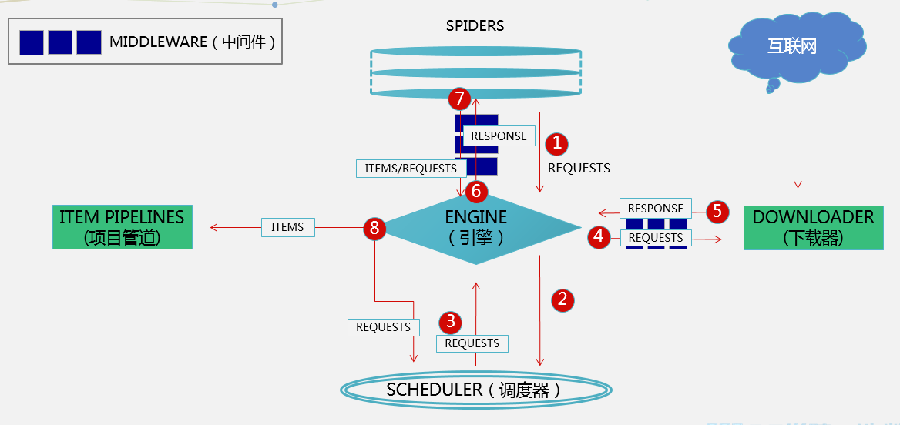

## 爬虫工程化及Scrapy框架初窥

本章节将会系统地介绍如何通过Scrapy框架把爬虫工程化。本节主要内容是：简单介绍Python和爬虫的关系，以及将要使用的Scrapy框架的工作流程。

Python适合做爬虫的原因

1. 语言本身简单，适合敏捷开发
2. 有比较完善的工具链
3. 足够灵活，以应对各种突然状况

爬虫的知识体系

1. 前端相关知识：html，css，js；浏览器相关知识；
2. 各种数据库的运用；
3. http协议的了解；
4. 对于前后台联动的方案；

爬虫进阶的工作流程



Scrapy运行流程:

1. Spiders发送第一个URL给引擎
2. 引擎从Spider中获取到第一个要爬取的URL后，在调度器(Scheduler)以Request调度
3. 调度器把需要爬取的request返回给引擎
4. 引擎将request通过下载中间件发给下载器(Downloader)去互联网下载数据
5. 一旦数据下载完毕，下载器获取由互联网服务器发回来的Response，并将其通过下载中间件发送给引擎
6. 引擎从下载器中接收到Response并通过Spider中间件发送给Spider处理
7. Spider处理Response并从中返回匹配到的Item及(跟进的)新的Request给引擎
8. 引擎将(Spider返回的)爬取到的Item给Item Pipeline做数据处理或者入库保存，将(Spider返回的)Request给调度器入队列
9. (从第三步)重复直到调度器中没有更多的request

补充资料

1. 什么是Scrapy框架？
 Scrapy是一个为了爬取网站数据，提取结构性数据而编写的应用框架。 可以应用在包括数据挖掘，信息处理或存储历史数据等一系列的程序中。
 其最初是为了页面抓取 (更确切来说, 网络抓取 )所设计的， 也可以应用在获取API所返回的数据(例如 Amazon Associates Web Services ) 或者通用的网络爬虫。

2. 使用Scrapy框架爬取数据与使用Requests+Xpath爬取数据，区别是什么？
 入门requests+Xpath相对来说更加简单，更能摸清爬虫每个详细的步骤。当你只是简单的爬取小量的网页（几千页），而不喜欢配置Scrapy框架繁重的设置，那requests+Xpath是不可多得的利器。
 requests+Xpath能够实现的功能，scrapy也能便捷地实现。scrapy是一个功能非常强大的爬虫框架，它不仅能便捷地构建request，还有强大的selector能够方便地解析response。
 然而最受欢迎的还是Scrapy的性能，即抓取和解析的速度。它的downloader是多线程的，request是异步调度和处理的。这两点使它的爬取速度非常之快。另外还有内置的logging，exception，shell等模块，为爬取工作带来了很多便利，使你的爬虫标准化和工程化。

3. Scrapy这么多组件都是干嘛的呢？
 - *引擎(Engine)*：用来处理整个系统的数据流，触发事务(框架核心)
 - *调度器(Scheduler)*：用来接受引擎发过来的请求，压入队列中，并在引擎再次请求的时候返回。可以想像成一个URL（抓取网页的网址或者说是链接）的优先队列，由它来决定下一个要抓取的网址是什么，同时去除重复的网址
 - *下载器(Downloader)*：用于下载网页内容，并将网页内容返回给引擎(Scrapy下载器是建立在twisted这个高效的异步模型上的)
 - *爬虫(Spiders)*：爬虫是主要干活的，用于从特定的网页中提取自己需要的信息，即所谓的实体（Item）。也可以从中提取出链接，让Scrapy继续抓取下一个页面
 - *项目管道(Item Pipelines)*：负责处理爬虫从网页中抽取的（Item），主要的功能是持久化实体、验证实体的有效性、清除不需要的信息。当页面被爬虫解析后，将被发送到项目管道，并经过几个特定的次序处理数据，并保存数据
 - *下载器中间件(Downloader Middlewares)*：位于Scrapy引擎和下载器之间的框架，主要是处理Scrapy引擎与下载器之间的请求及响应，是进行反反爬工作的重点
 - *爬虫中间件(Spider Middlewares)*：介于Scrapy引擎和爬虫之间的框架，主要工作是处理蜘蛛的响应输入和请求输出

开启下一节课程之前必须掌握的Python基础知识

** 迭代器、生成器和yield语句 **

** 迭代器 **

- 迭代是Python最强大的功能之一，是访问集合元素的一种方式；
- 迭代器是一个可以记住遍历的位置的对象；
- 迭代器对象从集合的第一个元素开始访问，直到所有的元素被访问完结束。迭代器只能往前不会后退；
- 迭代器有两个基本的方法：iter() 和 next()；
- 字符串，列表或元组对象都可用于创建迭代器；

```Python
>>> list=[1,2,3,4]
>>> it = iter(list)    # 创建迭代器对象
>>> print(next(it))   # 输出迭代器的下一个元素
1
>>> print(next(it))
2
```

** 生成器 **

Python使用生成器对延迟操作提供了支持。所谓延迟操作，是指在需要的时候才产生结果，而不是立即产生结果。这也是生成器的主要好处。

Python有两种不同的方式提供生成器：

- 生成器函数：常规函数定义，但是，使用yield语句而不是return语句返回结果。yield语句一次返回一个结果，在每个结果中间，挂起函数的状态，以便下次从它离开的地方继续执行
- 生成器表达式：类似于列表推导，但是，生成器返回按需产生结果的一个对象，而不是一次构建一个结果列表

生成器表达式：

```Python
>>> squares = [x**2 for x in range(5)]
>>> squares
[0, 1, 4, 9, 16]
>>> squares = (x**2 for x in range(5))
>>> squares
<generator object at 0x00B2EC88>
>>> next(squares)
0
>>> next(squares)
1
>>> next(squares)
4
>>> list(squares)
[9, 16]
```

在调用生成器函数运行的过程中，每次遇到 yield 时函数会暂停并保存当前所有的运行信息，返回yield的值。并在下一次执行 next()方法时从当前位置继续运行

```Python
>>> def mygenerator():  
...     print('start...')  
...     yield 5  
...   
>>> mygenerator()            //在此处调用,并没有打印出start...说明存在yield的函数没有被运行,即暂停  
<generator object mygenerator at 0xb762502c>  
>>> mygenerator().next()     //调用next()即可让函数运行.  
start...  
5
```

如果一个函数中出现多个yield，则next()会停止在下一个yield前。

```Python
>>> def fun2():  
...     print('first')
...     yield 5  
...     print('second')  
...     yield 23  
...     print('end...')  
...   
>>> g1 = fun2()  
>>> g1.next()             //第一次运行,暂停在yield 5               
first  
5  
>>> g1.next()             //第二次运行,暂停在yield 23  
second  
23  
>>> g1.next()             //第三次运行,由于之后没有yield,再次next()就会抛出错误  
end...  
Traceback (most recent call last):  
  File "<stdin>", line 1, in <module>  
StopIteration
```

** Python3 面向对象编程 **

- 面向对象编程是一种编程方式，此编程方式的落地需要使用 “类” 和 “对象” 来实现。所以，面向对象编程其实就是对 “类” 和 “对象” 的使用

- 类就是一个模板，模板里可以包含多个函数，函数里实现一些功能

- 对象则是根据模板创建的实例，通过实例对象可以执行类中的函数

面向对象三大特性

    面向对象的三大特性是指：封装、继承和多态

** 1. 封装 **

封装，顾名思义就是将内容封装到某个地方，以后再去调用被封装在某处的内容。
所以，在使用面向对象的封装特性时，需要：

- 将内容封装到某处
- 从某处调用被封装的内容

```Python
class Foo:

    def __init__(self, name, age):
        self.name = name
        self.age = age

    def detail(self):
        print(self.name)
        print(self.age)

obj1 = Foo('wupeiqi', 18)
obj1.detail()  # Python默认会将obj1传给self参数，即：obj1.detail(obj1)，所以，此时方法内部的 self ＝ obj1，即：self.name 是 wupeiqi ；self.age 是 18

obj2 = Foo('alex', 73)
obj2.detail()  # Python默认会将obj2传给self参数，即：obj1.detail(obj2)，所以，此时方法内部的 self ＝ obj2，即：self.name 是 alex ； self.age 是 78
```

** 2. 继承 **

面向对象中的继承和现实生活中的继承相同，即：子可以继承父的内容。

例如：
猫可以：喵喵叫、吃、喝、拉、撒
狗可以：汪汪叫、吃、喝、拉、撒

如果我们要分别为同为动物的猫和狗各创建一个类，那么就需要为猫和狗实现它们各自具有的功能，如果使用继承的思想，如下实现：

```Python
#定义一个“Animal”类，具有吃、喝、拉、撒的功能
class Animal:

    def eat(self):
        print("%s 吃 ") %self.name

    def drink(self):
        print("%s 喝 ") %self.name

    def shit(self):
        print("%s 拉 ") %self.name

    def pee(self):
        print("%s 撒 ") %self.name

#定义一个“Cat”类，继承“Animal”类所有功能，同时添加属于猫的“喵喵叫”功能
class Cat(Animal):

    def __init__(self, name):
        self.name = name
        self.breed ＝ '猫'

    def cry(self):
        print('喵喵叫')

#定义一个“Dog”类，继承“Animal”类所有功能，同时添加属于狗的“汪汪叫”功能
class Dog(Animal):

    def __init__(self, name):
        self.name = name
        self.breed ＝ '狗'

    def cry(self):
        print('汪汪叫')

# ######### 执行 #########

c1 = Cat('小白家的小黑猫')
c1.eat()

c2 = Cat('小黑的小白猫')
c2.drink()

d1 = Dog('胖子家的小瘦狗')
d1.eat()
```

** 多态 **

Python崇尚“鸭子类型”，也就是：当看到一只鸟走起来像鸭子、游泳起来像鸭子、叫起来也像鸭子，那么这只鸟就可以被称为鸭子。

在程序设计中，鸭子类型（英语：duck typing）是动态类型的一种风格。在这种风格中，一个对象有效的语义，不是由继承自特定的类或实现特定的接口，而是由当前方法和属性的集合决定。

扩展阅读

- 有能力的同学可以尝试去Scrapy框架官网查看[英文文档](https://doc.scrapy.org/en/latest/index.html)，学习更多关于Scrapy的使用和操作方法
- 或者也可以到Scrapy的[中文文档](http://docs.pythontab.com/scrapy/scrapy0.24/index.html)，学习更多关于Scrapy的使用和操作方法
- 重要的事情再重温一遍：需要再熟悉一下Python的生成器、以及面向对象编程的类、实例、继承等基础知识，从而开始服用下一节课程，此举为最佳。
- 可以前往[廖雪峰的官方网站：面向对象编程](https://www.liaoxuefeng.com/wiki/0014316089557264a6b348958f449949df42a6d3a2e542c000/0014318645694388f1f10473d7f416e9291616be8367ab5000)，阅读面向对象编程的知识
- 前往[廖雪峰的官方网站：生成器](https://www.liaoxuefeng.com/wiki/0014316089557264a6b348958f449949df42a6d3a2e542c000/0014317799226173f45ce40636141b6abc8424e12b5fb27000)，阅读生成器的知识
