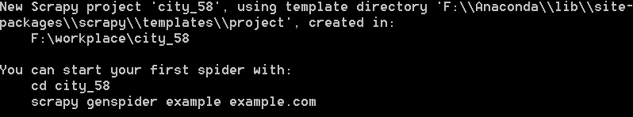
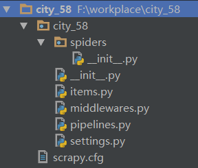

## Scrapy安装及基本使用

本节课主要介绍如何安装Scrapy，以及Scrapy的基本使用方法。

### Scrapy的安装

Windows下安装流程

方法一： 命令行执行`pip install scrapy 安装scrapy`

注意：如果有miniconda，也可以打开`Anaconda prompt`，激活环境以后使用命令：`conda install scrapy`

方法二：当遇到lxml报错信息，可以进入非官方安装包下载对应版本的lxml.whl文件。其它依赖包缺失错误，或者不兼容错误，也可以下载对应的.whl文件，使用`pip install 文件地址+文件名`的方式安装

Mac系统安装流程

可以直接使用`pip install scrapy`进行安装 
如果没有安装pip，可是使用以下命令行语句先安装pip：

`curl https://bootstrap.pypa.io/get-pip.py | python3`

### Scrapy爬虫的使用

一个基本的爬虫只需要两部分组成：Spider（爬虫）、Pipeline（管道）。

#### Spider是什么？

Spider类定义了如何爬取某个(或某些)网站，包括了爬取的动作(例如:是否跟进链接)以及如何从网页的内容中提取结构化数据(爬取item)。 换句话说，Spider就是定义爬取的动作及分析某个网页(或者是有些网页)的地方。

### 管道是什么？

每个项目管道组件是一个实现简单方法的Python类。他们接收一个项目并对其执行操作，还决定该项目是否应该继续通过流水线或被丢弃并且不再被处理。

管道的作用

Item管道的主要责任是负责处理有蜘蛛从网页中抽取的Item，它的主要任务是清洗、验证和存储数据。当页面被蜘蛛解析后，将被发送到Item管道，并经过几个特定的次序处理数据。

项目管道的典型用途是：

- 清理HTML数据
- 验证抓取的数据（检查项目是否包含特定字段）
- 检查重复（并删除）
- 将刮取的项目存储在数据库中

### 第一个Scrapy项目

在命令行输入`scrapy startproject city_58`，建立Scrapy项目，提示如图即成功。



得到如图的文件目录结构 



scrapy框架文件解析：

- city_58/：该项目的python模块。之后您将在此加入代码
- city_58/spiders/：放置spider代码的目录，在命令行使用“scrapy genspider + 爬虫名”生成的 - - spider文件将会被存放在此目录下
- city_58/items.py：项目中的item文件
- city_58/pipelines.py：项目中的pipelines文件
- city_58/settings.py：项目的设置文件
- scrapy.cfg：项目的配置文件，一般不需要修改，也不能删除

在cmd中切换到city_58文件中，输入`scrapy genspider spider_city_58 58.com`，在spider下面生成spider_city_58文件，代码如下：

```python
# -*- coding: utf-8 -*-
import scrapy

class SpiderCity58Spider(scrapy.Spider):
    name = 'spider_city_58'    #必不可少的属性，需要利用它去决定启动哪个爬虫
    allowed_domains = ['58.com']   
    start_urls = ['http://58.com/']   #从start_urls中启动链接 

    def parse(self, response):
        pass
```

Scrapy的基本方法和属性：

- 爬虫名称：name属性
- 启动方法：start_requests（），或者直接使用start_urls启动
- 默认解析器方法：parse（）
- 启动链接列表：start_urls属性

我们使用Scrapy的启动命令的时候，需要知道它的name属性，利用name属性去决定启动那个爬虫。如本例中爬虫名字是`spider_city_58`，则可以在命令行中使用：`scrapy crawl spider_city_58` 启动这个爬虫

爬虫默认首先从start_urls里面读取链接，然后自动调用start_request函数（或者你也可以自己定义start_request函数），此函数请求的结果自动调用默认解析器parse，也就是调用parse处理返回来的response

启动Scrapy框架 

为了方便知道请求到达了默认解析器parse，可以在解析器中输出一句话“我进入了解析器”

```python
# -*- coding: utf-8 -*-
import scrapy


class SpiderCity58Spider(scrapy.Spider):
    name = 'spider_city_58'
    allowed_domains = ['58.com']
    start_urls = ['http://58.com/']

    def parse(self, response):
        print('我进入了解析器')
```

启动方法：

- 第一种方法：打开命令行，切换到项目目录下，执行scrapy crawl spider_city_58。

- 第二种方法：在项目中建立一个main.py文件，然后运行该文件即可。

```python
from scrapy import cmdline
cmdline.execute("scrapy crawl spider_city_58".split())
```

### 课后作业：

利用Scrapy框架自行设计一个爬虫

### 补充资料

Scrapy常用命令行命令

Scrapy提供了两种类型的命令，分别为全局命令和项目命令

**项目命令**必须在Scrapy项目中运行，全局命令则不需要。因此，运行相关的项目命令时，必须把当前命令行的路径切换到对应的项目下

全局命令：

`startproject` `shell` `genspider` `fetch` `settings` `view` `runspider` `version`

项目命令

`crawl` `bench` `check` `list` `parse` `edit`

查看所有命令

```python
>>>scrapy -h
```

查看帮助信息

```python
>>>scapy –help
```

查看版本信息

```python
>>>scrapy version 
Scrapy 1.1.2

>>>scrapy version -v 
Scrapy : 1.4.0 
lxml : 3.8.0.0 
libxml2 : 2.9.4 
cssselect : 1.0.1 
parsel : 1.2.0 
w3lib : 1.18.0 
Twisted : 17.9.0 
Python : 3.6.2 |Anaconda custom (64-bit)| (default, Sep 19 2017, 08:03:39) [MSC v.1900 64 bit (AMD64)] 
pyOpenSSL : 17.2.0 (OpenSSL 1.0.2l 25 May 2017) 
Platform : Windows-8.1-6.3.9600-SP0
```

startproject命令：新建一个项目，后面跟的是项目名字

```python
>>>scrapy startproject spider_name
```

genspider命令： 

生成一个spider文件，一个工程中可以存在多个spider, 但是名字必须唯一； 
爬虫名字后面加上限制的主域名，也就是限制爬虫只爬取该域名页面下的数据； 
针对某个爬虫项目生成spider文件时，需要将命令行当前工作目录切换到对应的爬虫项目路径下

```python
>>>scrapy genspider name domain 
#例如: 
>>>scrapy genspider taobao taobao.com 
#指定了新生成的爬虫名字是“taobao”，限制爬取的主域名是“taobao.com”
```

查看当前项目内有多少爬虫

```python
>>>scrapy list
```


使用浏览器打开网页

```python
>>>scrapy view http://www.baidu.com
```

shell命令：进入scrapy交互环境，方便实时验证结果

```python
#进入该url的交互环境 
>>> scrapy shell http://www.dmoz.org/Computers/Programming/Languages/Python/Books/

# 之后便进入交互环境 
# 我们主要对这里面的response（也就是爬虫的响应文件）进行操作, 例如: 
>>> response.xpath() #括号里直接加xpath路径
```

runspider命令：用于直接运行创建的爬虫, 并不会运行整个项目

```python
>>>scrapy runspider 爬虫名称
```

fetch命令：使用Scrapy下载器下载给定的URL，并将内容写入标准输出。

```python
>>>scrapy fetch
```

settings：获取Scrapy设置的值。 如果在项目中使用，它将显示项目设置值，否则将显示该设置的默认Scrapy值。

```python
>>>scrapy settings [options]
```

parse命令：获取给定的URL并使用处理它的爬虫解析它，使用通过–callback选项传递的方法，或者parse如果没有给出。

```python
>>>scrapy parse [options]
```

scrapy项目文件的结构及用途

可以看到，在city_58项目文件夹下有city_58文件夹和scrapy.cfg文件，其中scrapy.cfg文件中主要包含的是项目的相关设置。而在scrapy文件夹下我们可以看到：

- Spiders文件夹：我们可以在Spiders文件夹下编写我们的爬虫文件，里面主要是用于分析response并提取返回的item或者是下一个URL信息，每个Spider负责处理特定的网站或一些网站。

- __init__.py:项目的初始化文件。

- items.py：定义我们所要爬取的信息的相关属性。Item对象是种容器，用来保存获取到的数据。

- middlewares.py:Spider中间件，在这个文件里我们可以定义相关的方法，用以处理蜘蛛的响应输入和请求输出。

- pipelines.py:在item被Spider收集之后，就会将数据放入到item pipelines中，在这个组件是一个独立的类，他们接收到item并通过它执行一些行为，同时也会决定item是否能留在pipeline，或者被丢弃。

- settings.py:提供了scrapy组件的方法，通过在此文件中的设置可以控制包括核心、插件、pipeline以及Spider组件。

我们来具体介绍一下我们在今后用的到的文件的基本用途：

**items.py**

双击打开这个文件,看一下都初始化了什么东西

```python
# -*- coding: urf-8 -*-
# Define here the models for your scrapyed items
#
# See documentation in
# http://doc.scrapy.org/en/latest/topics/items.html

import scrapy

class TaoBaoItem(scrapy.Item):
    # define the fields for your item here like:
    # 
    # name = scrapy.Filed()
    pass
```

通过里面的注释可见，这个文件的作用是定义我们要爬取信息的标准格式，打个比方说，如果我们要爬取一批人的个人信息，包括姓名，性别，生日，那么我们可以这样来书写这个文件

```python
import scrapy

class TaoBaoItem(scrapy.Item):
   name = scrapy.Filed()
   sex = scrapy.Filed()
   birthday = scrapy.Filed()
```

易见本文件只是定义了一个类，至于什么时候实例化它，怎么保存它，请继续了解下面的内容。

**settings.py**

如其名，这是本项目的配置文件，里面注释着很多常用的配置项，我们通过在其它文件中引入本文件的方式来使用这些配置项。 
当然，我们可以把这些注释都删掉，等需要开启哪个功能的时候再另行编辑

我们此处先看看默认打开的配置项吧

```python
BOT_NAME = 'taobao'
SPIDER_MODULES = ['taobao.spiders']
NEWSPIDER_MODULE = 'taobao.spider'
# Obey robots.txt rules
ROBORSTXT_OBEY = True
```

因为我们写的是定向爬虫，前面三个按默认即可，我们不去管他。看第四项，注释里说这个配置项的意思是遵守robots.txt，如果不遵守的话可以设置为False

**pipelines.py**

双击打开这个文件，看看都初始化了什么东西

```python
# -*- coding: utf-8 -*-

# Define your item pipelines here
# 
# Don't forget to add your pipeline to the ITEM_PIPELINES setting
# See: http://doc.scrapy.org/en/latest/topics/item-pipeline.html

class TaobaoPipeline(object):
    def process_item(self, item, spider):
        return item
```

注释提醒我们要启用Pipeline的话必须要在settings.py里配置一下ITEM_PIPELINES，配置好后，我们的setting.py如下：

```python
# -*- coding: utf-8 -*-

BOT_NAME = 'taobao'
SPIDER_MODULES = ['taobao.spiders']
NEWSPIDER_MODULE = 'taobao.spider'

ROBORSTXT_OBEY = True

ITEM_PIPELINES = {
    'taobao.pipelines.TaobaoPipeline': 300,
}
```

此处的300表示优先级，数字越小优先级越高，代表这个Pipeline会越优先被执行。因为本项目只用到这一个pipeline，所以随意取0-1000中的一个数值即可。

再回到pipelines.py这个文件，这个文件到底有什么用呢？

- 对爬取到的数据(Item)进行处理，比如存入数据库
- 爬虫结束时产生事件，比如发送一封邮件

此处只是介绍一下，具体的操作要看后续教程。

爬虫

以上为默认生成的项目结构，而爬虫文件我们需要自己写。

在默认生成的spiders目录下新建Taobao_spider.py,我们的爬虫就写在这里面。下面为一个简单的下载网页源代码的爬虫。

```python
import scrapy

class TaobaoSpider(scrapy.Spider):
    name = "taobao"  # 爬虫的名字，执行时使用
    start_urls = [
        'https://s.taobao.com/search?q=%E8%BF%9E%E8%A1%A3%E8%A3%99&imgfile=&js=1&stats_click=search_radio_all%3A1'
        '&initiative_id=staobaoz_20171101&ie=utf8'
    ]
    def parse(self, response):  # 真正的爬虫方法
        html = response.body  # response是获取到的来自网站的返回
        # 以下四行将html存入文件
        filename = "index.html"
        file = open(filename, "w")
        file.write(html)
        file.close()
```

需要说明的是：这个类不是随心所欲来写的，name，allowed_domains，start_urls，都是类似于“重载”的值。也就是说，scrapy内部会检测这些变量的值，变量名不可以起成其它的名字，类似的变量之后还会有介绍。至于parse方法，就是重载的父类的方法，我们爬虫的主体一般就写在这里面

敲黑板

- 有能力的同学可以尝试去Scrapy框架官网查看[英文文档](https://doc.scrapy.org/en/latest/)，解锁更多关于Scrapy框架最新的使用和操作方法
- 老师上课说的大神必备：[windows 命令行基本操作命令介绍](http://blog.csdn.net/wangxiaohong123/article/details/6592141)
