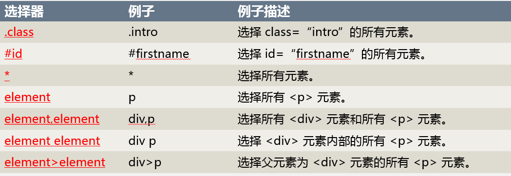
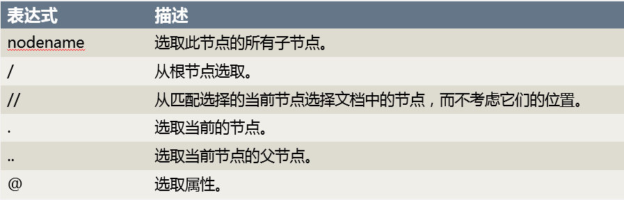

## Scrapy选择器的用法

当我们抓取网页时，最常见任务就是从HTML源码中提取数据，可是怎么提取数据呢？当然就是用选择器了。本节课主要介绍CSS，Xpath，正则表达式，pyquery四种选择器。

### 四大选择器

Scrapy 提取数据有自己的一套机制。它们被称作选择器(seletors)，通过特定的 Xpath 、 CSS 表达式或者正则表达式来选择 HTML 文件中的某个部分的数据。

我们常用的选择器有四种：CSS选择器，Xpath选择器，正则表达式，pyquery选择器。Scrapy内置了三种选择器，分别是CSS选择器，Xpath选择器，正则表达式，使用pyquery需要另外安装pyquery库

CSS的使用方法

CSS 是一门将 HTML 文档样式化的语言。选择器由它定义，并与特定的 HTML 元素的样式相关联。在CSS中，选择器是一种模式，用于选择需要添加样式的元素。

应用给定的CSS选择器时，返回 `SelectorList` 的一个实例，query 是一个包含CSS选择器的字符串 
该方法可以通过 response.css() 调用

CSS3选择器



CSS选择器使用示例：
我们使用一个自定义的网页源码演示css选择器的用法

html源码如下：

```html
<body>
    <ul>

        <li class="top">
            <div>li的div</div>
        </li>

        <li class="top">
            <div>
            <div>li的div的div</div>div>
            </div>
        </li>

        <li>
        <p>li的p</p>    
        </li>

        <li>
        <a>
        <div id="li_a_div">li的a的div</divid>    
        </a>    
        </li>
    </ul>
</body>
```

打开同级目录下的HTML文件，所获取的sel变量是Selector变量，可以直接使用sel.css()对其进行选择：

```python
from scrapy import Selector

with open('test.html' , encoding='utf-8') as f:
    text = f.read()

sel = Selector(text=text)
```

选择 `class='top'` 的元素：

```python
>>>sel.css('.top') 
#可见其返回了一个SelectorList实例
```

选择 `id='li_a_div'`的元素：

```python
>>>sel.css('#li_a_div') 
#可见其返回了一个SelectorList实例
```

选择所有的元素：

```python
>>>sel.css('*') 
#可见其返回了一个SelectorList实例
```

选择li元素内部的所有div的元素：

```python
>>>sel.css('li div') 
#中间是空格 
#可见其返回了一个SelectorList实例
```

选择父元素为li元素的所有div的元素：

```python
>>>sel.css('li > div') 
#中间是">" 
#可见其返回了一个SelectorList实例
```

选择所有的div元素和所有的li元素：

```python
>>>sel.css('li,div') 
#中间是“，” 
#可见其返回了一个SelectorList实例
```

想要提取出数据，需要调用.extract()方法，比如：

```python
>>> sel.css("li > div").extract()
```

想要直接得到列表中第一个元素，可以调用.extract_first()方法，比如：

```python
>>>sel.css('li > div').extract_first()
```


Xpath的使用方法

寻找可以匹配 xpath query 的节点，并返回 SelectorList 的一个实例结果，单一化其所有 元素。列表元素也实现了 Selector 的接口。query 是包含XPATH查询请求的字符串 

该方法可以通过 response.xpath() 调用

选取节点

Xpath 使用路径表达式在 XML文档中选取节点。节点是通过沿着路径或者step来选取的。 
下面列出了最有用的路径表达式：



Xpath选择器使用示例：

Xpath选择方法之前在入门课程第四课已学习过了，仍然使用上面的例子： 


查找ul标签下的li元素：

```python
>>>sel.xpath(‘/html/body/ul/li’) 
#可见其返回了一个SelectorList实例
```

查找所有的li标签：

```python
>>>sel.xpath(‘//li’) 
#可见其返回了一个SelectorList实例
```

查找第三个li标签下的第一个p标签：

```python
>>>sel.xpath(‘//li’)[2].xpath(‘./p’)[0] 
#可见其返回了一个SelectorList实例
```

同样可以调用`.extract()`方法提取数据： 
查找a标签下的div标签的文本：

```python
>>>sel.xpath(‘/html/body/ul/li/a/div/text()’).extract_first()
```

RE的使用方法

正则表达式，又称规则表达式。（英语：Regular Expression，在代码中常简写为regex、regexp或RE）它通常被用来检索、替换那些符合某个模式(规则)的文本。

匹配神器

- `(.*)` 具有贪婪的性质，首先匹配到不能匹配为止，根据后面的正则表达式，会进行回溯
- `(.*?)` 则相反，一个匹配以后，就往下进行，所以不会进行回溯，具有最小匹配的性质。

pyquery的使用方法

pyquery可以让你使用类似jQuery语法来对xml进行操作，pyquery语法尽可能跟jQuery语法相似 
pyquery使用lxml库对xml和html进行快速的处理 
pyquery这个库目前还不是一个可以跟JavaScript代码交互的库

pyquery选择器使用示例：

打开同级目录下的HTML文件，所获取的jpy变量是PyQuery，可以直接使用jpy对其进行选择：

```python
from pyquery import PyQuery
with open('test.html' , encoding='utf-8') as f:
    text = f.read()

jpy = PyQuery(text)
pass
```

查找class=‘top’的元素的文本：


    >>>jpy(‘.top’).text()

查找class=‘top’的元素的class属性：

    >>>jpy(‘.top’).attr(‘class’)

查找li标签下所有的文本

```python
>>>items = jpy(‘li’) 
>>>for i in items.items(): 
>>>···· print(i.text()) 
li的div 
li的div的div 
li的p 
li的a的div
```

查找li标签下所有的class属性

```python
>>>items = jpy(‘li’) 
>>>for i in items.items(): 
>>>···· print(i.attr(‘class’)) 
top 
top 
None 
None
```

### 课后作业

- 选4种选择器中的一种对其高级语法学习
- 学习和掌握正则表达式的用法
- 尝试使用高级语法解析一些页面

### 补充资料

本节课老师介绍了四种选择器，其中正则表达式是必须学习的，其它三种只需挑一种自己喜欢的进行学习并且精通就好。注意一定要通过实际的网站多加练习如何提取到自己想要的数据

- CSS、Xpath和正则表达式：可以前往[选择器(Selectors)](http://wiki.jikexueyuan.com/project/scrapy/selectors.html)，学习更加全面的选择器用法
- 正则表达式：正则表达式是程序猿的必备技能，不仅在scrapy中可以用到，清洗数据、SQL数据库提取数据等都可以用到，所以一定要多加学习：[正则表达式](http://www.runoob.com/regexp/regexp-intro.html)
- 谷歌浏览器具有一款拓展插件叫“XPath Helper”，可以在浏览器页面直接写Xpath query，即时显示所写的Xpath选择到的结果，非常好用，可以自行下载
