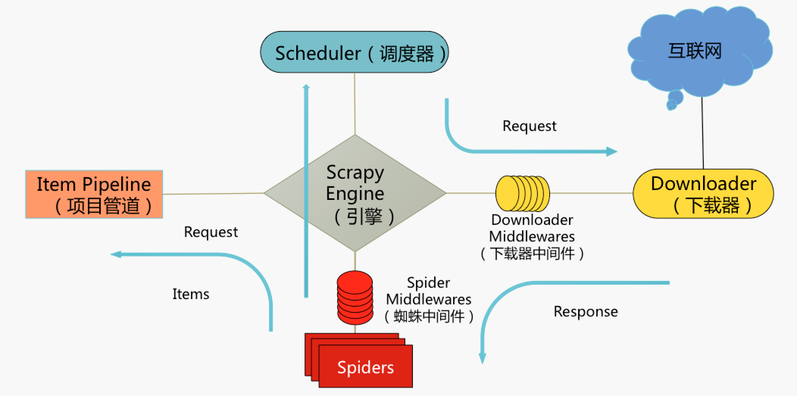
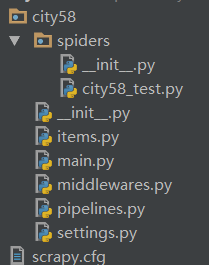

## Scrapy的项目管道

上一节已学习了选择器的应用，可是爬取到了结果该怎么处理呢？本节课主要介绍Scrapy框架的另一部分——Item管道，用于处理爬取到的数据

### Item管道（Item Pipeline）的介绍



#### 管道是什么

Item管道(Item Pipeline)：

- 主要负责处理有蜘蛛从网页中抽取的Item，主要任务是清洗、验证和存储数据。
- 当页面被蜘蛛解析后，将被发送到Item管道，并经过几个特定的次序处理数据。
- 每个Item管道的组件都是有一个简单的方法组成的**Python类**。
- 它们获取了Item并执行它们的方法，同时还需要确定是否需要在Item管道中继续执行下一步或是直接丢弃掉不处理。

[类(Class)](http://www.runoob.com/python3/python3-class.html): 用来描述具有相同的属性和方法的对象的集合。它定义了该集合中每个对象所共有的属性和方法。对象是类的实例。

#### 管道的作用
- 清理HTML数据
- 验证抓取的数据（检查项目是否包含特定字段）
- 检查重复（并删除）
考虑到性能的原因，去重最好在链接中去重，或者利用数据库主键的唯一性去重
- 将刮取的项目存储在数据库中

#### Item管道主要函数：

##### process_item(self, item, spider) 必须实现（也是用的最多的方法)

每个 Item Pipeline 组件都需要调用该方法，这个方法必须返回一个 Item (或任何继承类)对象， 或是抛出 DropItem 异常，被丢弃的 item 将不会被之后的 pipeline 组件所处理

需要传入的参数为：

- `item` (Item 对象) ： 被爬取的 item
- `spider` (Spider 对象) ： 爬取该 item 的 spider

该方法会被每一个 item pipeline 组件所调用，process_item 必须返回以下其中的任意一个对象：

- 一个 dict
- 一个 Item 对象或者它的子类对象
- 一个 Twisted Deferred 对象
- 一个 DropItem exception；如果返回此异常，则该 item 将不会被后续的 item pipeline 所继续访问

**注意**：该方法是Item Pipeline必须实现的方法，其它三个方法（open_spider/close_spider/from_crawler）是可选的方法

**举例说明1**

以下假设的管道，它调整 price那些不包括增值税（price_excludes_vat属性）的项目的价格，并删除那些不包含价格的项目

```python
from scrapy.exceptions import DropItem

class PricePipeline(object):
    vat_factor = 1.15
    def process_item(self, item, spider):
        if item['price']: #是否有价格
            if item['price_excludes_vat']: #如果价格不包括增值税，则把价格乘上一个增值税系数
                item['price'] = item['price'] * self.vat_factor
            return item
        else: #如果没有价格，则抛弃这个item
            raise DropItem("Missing price in %s" % item)
```

**举例说明2**

此例主要是用于查找重复Item并删除已处理的Item的过滤器。假设我们的Item具有唯一的ID，但是我们的Spider会返回具有相同id的多个Item：

```python
from scrapy.exceptions import DropItem
class DuplicatesPipeline(object):

    def __init__(self):
        self.ids_seen = set() #初始化中，创建一个空集合

    def process_item(self, item, spider):
        #查看id是否在ids_seen中，如果在，就抛弃该Item，如果不在就添加到ids_seen中，下一次其它Item有相同的id就抛弃那个Item
        if item['id'] in self.ids_seen:
            raise DropItem("Duplicate item found: %s" % item)
        else:
            self.ids_seen.add(item['id'])
            return item #记住一定要返回Item
```

##### open_spider(self, spider) —— 非必需，为爬虫启动的时候调用；

当 spider 被开启时，这个方法被调用。可以实现在爬虫开启时需要进行的操作，比如说打开一个待写入的文件，或者连接数据库等

需要传入的参数：

- spider (Spider 对象) ： 被开启的 spider

##### close_spider(self, spider) —— 非必需， 为爬虫关闭的时候调用；

当 spider 被关闭时，这个方法被调用。可以实现在爬虫关闭时需要进行的操作，比如说关闭已经写好的文件，或者关闭与数据库的连接

需要传入的参数：

- spider (Spider 对象) ： 被关闭的 spider

举例说明：

将项目写入JSON文件
以下管道将所有抓取的Item（来自所有蜘蛛）存储到单个items.json文件中，每行包含一个项目，以JSON格式序列化：

```python
import json
class JsonWriterPipeline(object):
    def open_spider(self, spider):
        #在爬虫开始时打开文件
        self.file = open('items.json', 'w')

    def close_spider(self, spider):
        #在爬虫结束时关闭文件
        self.file.close()

    def process_item(self, item, spider):
        #把爬取到的item转换为json格式，保存进文件
        line = json.dumps(dict(item)) + "\n"
        self.file.write(line)
        return item #注意要返回item
```

##### from_crawler(cls, crawler) —— 非必需，也是在启动的时候调用，比 open_spider早。

该类方法用来从 Crawler 中初始化得到一个 pipeline 实例；它必须返回一个新的 pipeline 实例；[Crawler 对象](https://doc.scrapy.org/en/latest/topics/api.html#scrapy.crawler.Crawler)提供了访问所有 Scrapy 核心组件的接口，包括 settings 和 signals

需要传入的参数：

- crawler (Crawler 对象) ： 使用该管道的crawler
举例说明：

此例主要使用pymongo将项目写入MongoDB。MongoDB地址和数据库名称在Scrapy设置中指定； MongoDB集合以item类命名

from_crawler()方法是创建通往Crawler的pipeline，返回一个新的pipeline实例
这个例子的要点是显示如何使用from_crawler()方法和如何正确清理资源

通过类方法 from_crawler() 在内部初始化得到了一个 pipeline 实例，初始化的过程中，使用了 mongo_uri 以及 mongo_db 作为构造参数

```python
import pymongo

class MongoPipeline(object):

    collection_name = 'scrapy_items'

    def __init__(self, mongo_uri, mongo_db):
        self.mongo_uri = mongo_uri
        self.mongo_db = mongo_db

    @classmethod
    def from_crawler(cls, crawler):
        return cls(
            mongo_uri=crawler.settings.get('MONGO_URI'),
            mongo_db=crawler.settings.get('MONGO_DATABASE', 'items')
        )

    def open_spider(self, spider):
        self.client = pymongo.MongoClient(self.mongo_uri)
        self.db = self.client[self.mongo_db]

    def close_spider(self, spider):
        self.client.close()

    def process_item(self, item, spider):
        self.db[self.collection_name].insert_one(dict(item))
        return item
```

### 案例：爬取58同城

爬取58同城步骤如下：

1. 在命令行输入 scrapy startproject city58，使用cd city58进入项目目录，使用scrapy genspider city58_test 58.com生成爬虫
2. 访问58同城网站，打开开发者工具，查看elements
3. 查找含有目标信息的元素，提取目标网页的url，填入新建的Scrapy项目中Spider文件下的start_url中，并编写Spider
4. 编写Items（用于定义需要爬取的字段）和PIpeLine（处理Item）两个文件，以及修改setting文件（启动管道），创建main文件
5. 运行main文件，启动Scrapy爬虫


文件结构如下：



代码如下：

items.py：定义我们所要爬取的信息的相关属性，此例中需要爬取的是name、price、url

```python
import scrapy

class City58Item(scrapy.Item):
    # define the fields for your item here like:
    name = scrapy.Field()
    price = scrapy.Field()
    url = scrapy.Field()
```

city58_test.py：主要是用于定义请求链接，并使用pyquery选取目标元素

```python
import scrapy
from pyquery import PyQuery
from ..items import City58Item

class City58TestSpider(scrapy.Spider):
    name = 'city58_test'  #必不可少的爬虫名字，启动的关键
    allowed_domains = ['58.com']
    start_urls = ['http://bj.58.com/chuzu/']   #开始爬取的链接

    def parse(self, response):
        jpy = PyQuery(response.text)
        li_list = jpy('body > div.mainbox > div.main > div.content > div.listBox > ul > li').items() #记得带上.items()
        for it in li_list:
            a_tag = it(' div.des > h2 > a')
            item = City58Item()
            item['name'] = a_tag.text()   #a_tag取出文本
            item['url'] = a_tag.attr('href')  #取出href参数
            item['price'] = it('div.listliright > div.money > b').text()
            yield item   #把Item返回给引擎
```

pipeline.py：当item数据被city58_test爬虫爬取好并返回给引擎以后，引擎会把item交给City58Pipeline这个管道处理。这个pipeline文件负责打开关闭文件，并写入文件

```python
import json

class City58Pipeline(object):
    #打开文件
    def open_spider(self,spider):
        self.file = open('58_chuzu.txt', 'w' , encoding='utf8')
        print('打开文件了')
    #写入文件
    def process_item(self, item, spider):
        line = '{}\n'.format(json.dumps(dict(item)))  #把item转换成字符串
        self.file.write(line)
        return item
    #关闭文件
    def close_spider(self, spider):
        self.file.close()
        print('关闭文件了')
```

settings.py：开启City58Pipeline这个管道

```python
ITEM_PIPELINES = {
‘city58.pipelines.City58Pipeline’: 300,
}
```

main.py：运行爬虫

```python
from scrapy import cmdline
cmdline.execute("scrapy crawl city58_test".split())
```

### 课后作业

试试看，通过自己查资料，能否搞明白以下代码的作用：

```python
import scrapy
import hashlib
from urllib.parse import quote

class ScreenshotPipeline(object):
    """Pipeline that uses Splash to render screenshot of
    every Scrapy item."""

    SPLASH_URL = "http://localhost:8050/render.png?url={}"

    def process_item(self, item, spider):
        encoded_item_url = quote(item["url"])
        screenshot_url = self.SPLASH_URL.format(encoded_item_url)
        request = scrapy.Request(screenshot_url)
        dfd = spider.crawler.engine.download(request, spider)
        dfd.addBoth(self.return_item, item)
        return dfd

    def return_item(self, response, item):
        if response.status != 200:
            # Error happened, return item.
            return item

        # Save screenshot to file, filename will be hash of url.
        url = item["url"]
        url_hash = hashlib.md5(url.encode("utf8")).hexdigest()
        filename = "{}.png".format(url_hash)
        with open(filename, "wb") as f:
            f.write(response.body)

        # Store filename in item.
        item["screenshot_filename"] = filename
        return item
```

### 补充资料

- 有能力的同学可以去GitHub浏览[Scrapy的源码](https://github.com/scrapy/scrapy)，更深入地理解Scrapy的使用和操作方法
- 有兴趣的同学可以尝试去爬取京东的商品，这里有一个[京东爬虫](https://github.com/taizilongxu/scrapy_jingdong)开源的项目，大家可以参考一下
