## 爬虫工程师进阶（七）：HTTP请求分析

Chrome浏览器相对于其他的浏览器而言，DevTools（开发者工具）非常强大。这节课将为大家介绍怎么利用Chrome浏览器的开发者工具进行HTTP请求分析

### Chrome浏览器讲解

Chrome 开发者工具是一套内置于Google Chrome中的Web开发和调试工具，可用来对网站进行迭代、调试和分析

#### 打开Chrome开发工具

1. 在Chrome菜单中选择更多工具 >开发者工具
2. 在页面元素上右键点击，选择"检查"
3. 或者使用快捷键：Ctrl+Shift+I (Windows) 或 Cmd+Opt+I (Mac)

#### 开发者工具的功能结构

- Elements（元素面板）：使用"元素"面板可以通过自由操纵DOM和CSS来重演您网站的布局和设计。
- Console（控制台面板）：在开发期间，可以使用控制台面板记录诊断信息，或者使用它作为 shell，在页面上与JavaScript交互
- Sources（源代码面板）：在源代码面板中设置断点来调试 JavaScript ，或者通过Workspaces（工作区）连接本地文件来使用开发者工具的实时编辑器
- Network（网络面板）：从发起网页页面请求Request后得到的各个请求资源信息（包括状态、资源类型、大小、所用时间等），并可以根据这个进行网络性能优化
- Performance（性能面板）：使用时间轴面板，可以通过记录和查看网站生命周期内发生的各种事件来提高页面运行时的性能
- Memory（内存面板）：分析web应用或者页面的执行时间以及内存使用情况
- Application（应用面板）：记录网站加载的所有资源信息，包括存储数据（Local Storage、Session Storage、-IndexedDB、Web SQL、Cookies）、缓存数据、字体、图片、脚本、样式表等
- Security（安全面板）：使用安全面板调试混合内容问题，证书问题等等
- Audits（审核面板）：对当前网页进行网络利用情况、网页性能方面的诊断，并给出一些优化建议。比如列出所有没有用到的CSS文件等

### Network（网络）面板

Network 面板记录页面上每个网络操作的相关信息，包括详细的耗时数据、HTTP 请求与响应标头和 Cookie

Network面板由五个窗格组成：

1. Controls：使用这些选项可以控制 Network 面板的外观和功能
2. Filters： 使用这些选项可以控制在 Requests Table 中显示哪些资源。提示：按住 Cmd (Mac) 或 Ctrl (Windows/Linux) 并点击过滤器可以同时选择多个过滤器
3. Overview： 此图表显示了资源检索时间的时间线。如果您看到多条竖线堆叠在一起，则说明这些资源被同时检索
4. Requests Table： 此表格列出了检索的每一个资源。 默认情况下，此表格按时间顺序排序，最早的资源在顶部。点击资源的名称可以显示更多信息。 提示：右键点击 Timeline 以外的任何一个表格标题可以添加或移除信息列
5. Summary： 此窗格可以一目了然地告诉您请求总数、传输的数据量和加载时间

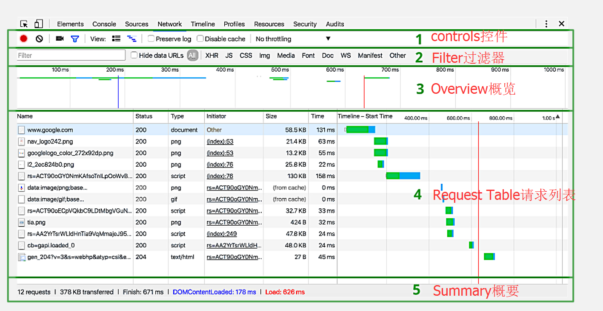

#### Controls（控件）

使用这些选项可以控制 Network(网络)面板的外观和功能。

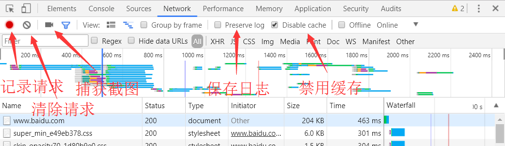

#### Filters（过滤器）

使用这些选项可以控制在请求列表中显示哪些资源。

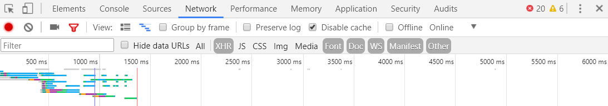

提示：按住Cmd（Mac）或Ctrl（Window / Linux），然后点击过滤器可以同时选择多个过滤器。

此外，筛选框可以实现很多定制化的筛选，比如字符串匹配，关键词筛选等，其中关键词筛选主要有如下几种：

- `domain`：仅显示来自指定域的资源。您可以使用通配符（）来包括多个域。例如，.com显示以.com结尾的所有域名中的资源。 DevTools会在自动完成下拉菜单中自动填充它遇到的所有域。
- `has-response-header`：显示包含指定HTTP响应头信息的资源。 DevTools会在自动完成下拉菜单中自动填充它遇到的所有响应头。
- `is`：通过is:running找出WebSocket请求。
- `larger-than`(大于) ：显示大于指定大小的资源（以字节为单位）。设置值1000等效于设置值1k。
- `method`(方法) ：显示通过指定的HTTP方法类型检索的资源。DevTools使用它遇到的所有HTTP方法填充下拉列表。
- `mime-type`（mime类型：显示指定MIME类型的资源。 DevTools使用它遇到的所有MIME类型填充下拉列表。
- `mixed-content`（混合内容：显示所有混合内容资源（mixed-content:all）或仅显示当前显示的内容（mixed-content:displayed）。
- `Scheme`（协议）：显示通过不受保护的HTTP（scheme:http）或受保护的HTTPS（scheme:https）检索的资源。
- `set-cookie-domain`（cookie域）：显示具有Set-Cookie头,并且其Domain属性与指定值匹配的资源。DevTools会在自动完成下拉菜单中自动填充它遇到的所有Cookie域。
- `set-cookie-name`（cookie名）：显示具有Set-Cookie头,并且名称与指定值匹配的资源。DevTools会在自动完成下拉菜单中自动填充它遇到的所有Cookie名。
- `set-cookie-value`（cookie值）：显示具有Set-Cookie头,并且值与指定值匹配的资源。DevTools会在自动完成下拉菜单中自动填充它遇到的所有cookie值。
- `status-code`（状态码）：仅显示其HTTP状态代码与指定代码匹配的资源。DevTools会在自动完成下拉菜单中自动填充它遇到的所有状态码。

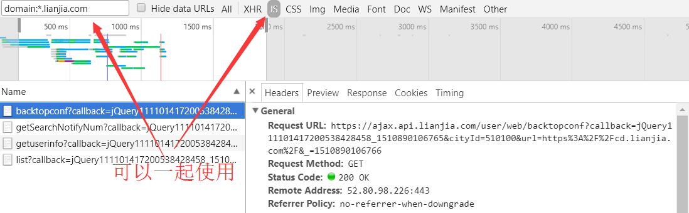

#### Overview（概览）

这个图表显示检索资源的时间轴。如果您看到多个垂直堆叠的栏，这意味着这些资源被同时检索。

#### Requests Table（请求列表）

此列表列出了检索的每个资源。默认情况下，此表按时间顺序排序，也就是最早的资源在顶部。单击资源名称可以获得更多信息。

提示：右键单击列表的任何标题栏可以以添加或删除信息列。

#### 查看单个资源的详细信息

点击资源名称（位于 Requests Table 的 Name 列下）可以查看与该资源有关的更多信息。
可用标签会因您所选择资源类型的不同而不同，但下面四个标签最常见：

- Headers：与资源关联的 HTTP 标头。
- Preview：JSON、图像和文本资源的预览。
- Response：HTTP 响应数据（如果存在）。
- Timing：资源请求生命周期的精细分解。

##### Headers（查看 HTTP 标头）
点击 Headers 可以显示该资源的标头。
Headers 标签可以显示资源的请求网址、HTTP 方法以及响应状态代码。 此外，该标签还会列出 HTTP 响应和请求标头、它们的值以及任何查询字符串参数

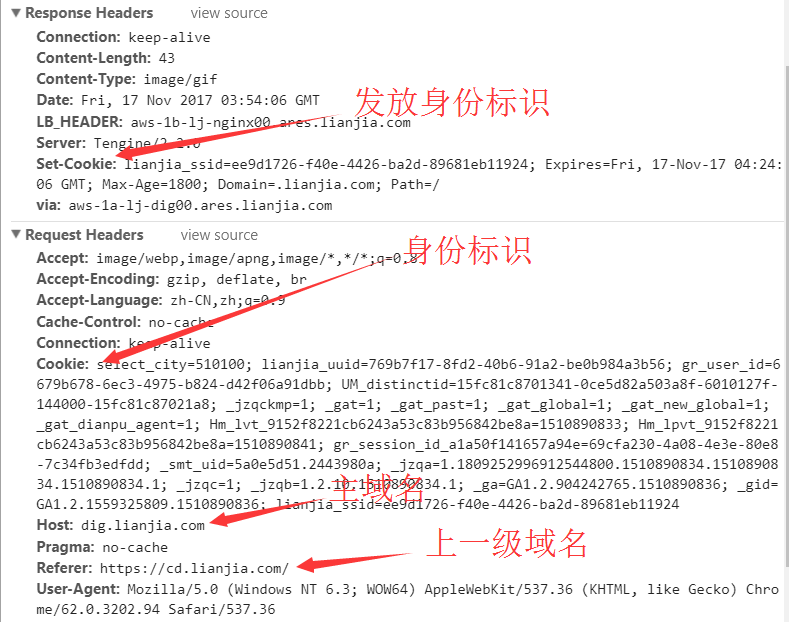

点击每一部分旁边的 view source 或 view parsed 链接，您能够以源格式或者解析格式查看响应标头、请求标头或者查询字符串参数。

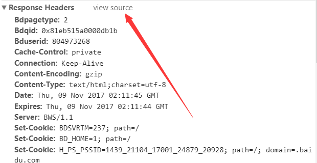

##### Preview（预览资源）

点击 Preview 标签可以查看该资源的预览。Preview 标签可能显示一些有用的信息，也可能不显示，具体取决于您所选择资源的类型。![|center|600*0(./1510193933148.png)

##### Response（查看 HTTP 响应内容）

点击 Response 标签可以查看资源未格式化的 HTTP 响应内容。 Preview 标签可能包含一些有用的信息，也可能不包含，具体取决于您所选择资源的类型。

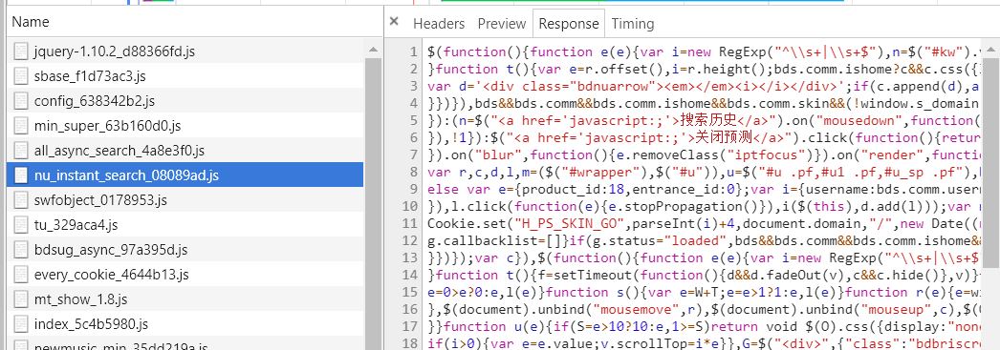

##### 查看 Cookie

点击 Cookies 标签可以查看在资源的 HTTP 请求和响应标头中传输的 Cookie 表。 只有传输 Cookie 时，此标签才可用。

下面是 Cookie 表中每一列的说明：

- Name：Cookie 的名称。
- Value：Cookie 的值。
- Domain：Cookie 所属的域。
- Path：Cookie 来源的网址路径。
- Expires / Max-Age：Cookie 的 expires 或 max-age 属性的值。
- Size：Cookie 的大小（以字节为单位）。
- HTTP：指示 Cookie 应仅由浏览器在 HTTP 请求中设置，而无法通过 JavaScript 访问。
- Secure：如果存在此属性，则指示 Cookie 应仅通过安全连接传输。

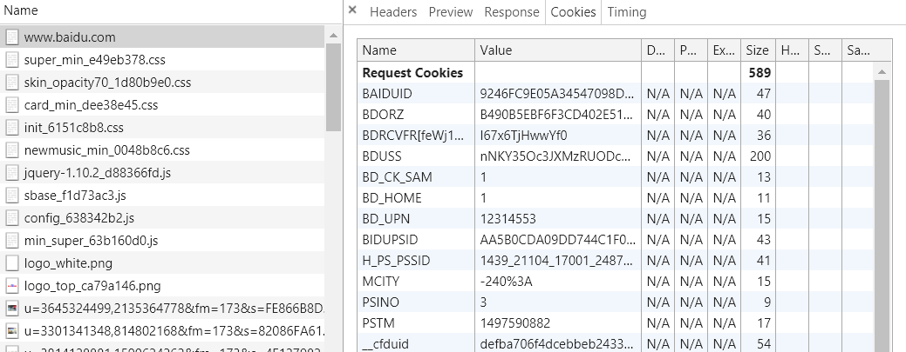

#### 复制、保存和清除网络信息

右键单击Requests Table（请求列表）以复制、保存或删除网络信息。一些选项是上下文相关的，所以如果想在单个资源上操作，需要右键单击该资源行。下面的列表描述了每个选项

- Copy Response（复制响应）

将所选资源的HTTP响应复制到系统剪贴板。

- Copy as cURL（复制为cURL）

将所选资源的网络请求作为cURL命令字符串复制到系统剪贴板。 请参阅将复制请求为cURL命令。
curl命令是一个利用URL规则在命令行下工作的文件传输工具。它支持文件的上传和下载，所以是综合传输工具，但按传统，习惯称curl为下载工具。作为一款强力工具，curl支持包括HTTP、HTTPS、ftp等众多协议，还支持POST、cookies、认证、从指定偏移处下载部分文件、用户代理字符串、限速、文件大小、进度条等特征。做网页处理流程和数据检索自动化，curl可以祝一臂之力。l

- Copy All as HAR（全部复制为HAR）

将所有资源复制到系统剪贴板作为HAR数据。 HAR文件包含描述网络"瀑布"的JSON数据结构。一些第三方工具可以使用HAR文件中的数据重建网络瀑布。有关详细信息，请参阅Web性能强大工具：HTTP归档（HAR）。

- Save as HAR with Content（另存为带内容的HAR）

将所有网络数据与每个页面资源一起保存到HAR文件中。 二进制资源（包括图像）被编码为Base64编码文本。

- Clear Browser Cache（清除浏览器缓存）

清除浏览器高速缓存。提示：您也可以从Network Conditions(网络条件)抽屉式窗格中启用或禁用浏览器缓存。

- Clear Browser Cookies（清除浏览器Cookie）

清除浏览器的Cookie。

- Open in Sources Panel（在源文件面板中打开）

在Sources(源文件)面板中打开选定的资源。

- Open Link in New Tab（在新标签页中打开链接）

在新标签页中打开所选资源。您还可以在Requests Table(请求列表)中双击资源名称。

- Copy Link Address（复制链接地址）

将资源URL复制到系统剪贴板。

- Save（保存）

保存所选的文本资源。仅显示在文本资源上。

- Replay XHR（重新发送XHR）

重新发送所选的XMLHTTPRequest。仅显示在XHR资源上。

#### 查看资源发起者和依赖关系

按住Shift并移动鼠标到资源上可查看它的发起者和依赖关系。这部分是你鼠标悬停的资源的target(目标)引用。
从target(目标)往上查找，第一个颜色编码为绿色的资源是target(目标)的发起者。如果存在第二个颜色编码为绿色资源，那么这个是发起者的发起者。从target(目标)向下查找，任何颜色编码为红色的资源都是target的依赖。

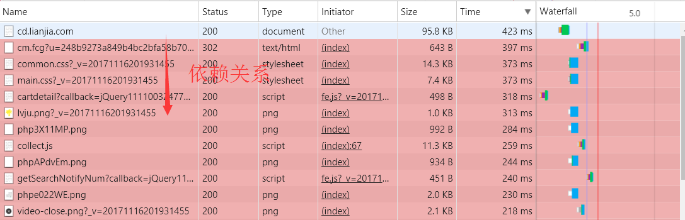

### 补充资料

#### Sources面板

在源代码面板中设置断点来调试 JavaScript ，或者通过Workspaces（工作区）连接本地文件来使用开发者工具的实时编辑器。

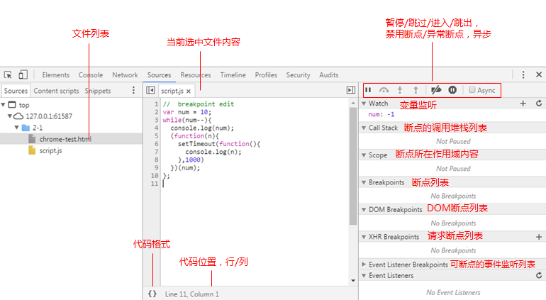

在Sources面板中，连js都可以直接修改。主要是在设置断点(breakpoint)进行单步调试时用的;

1. ctr+shift+i或者F12打开开发者工具；
2. 打开sources面板;直接给某行js代码设置断点。

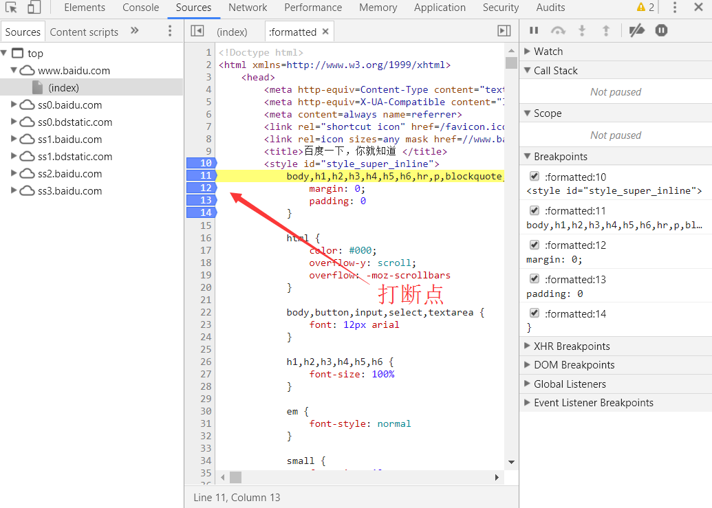

刷新页面后，程序就会停在断点设置的那一行上。

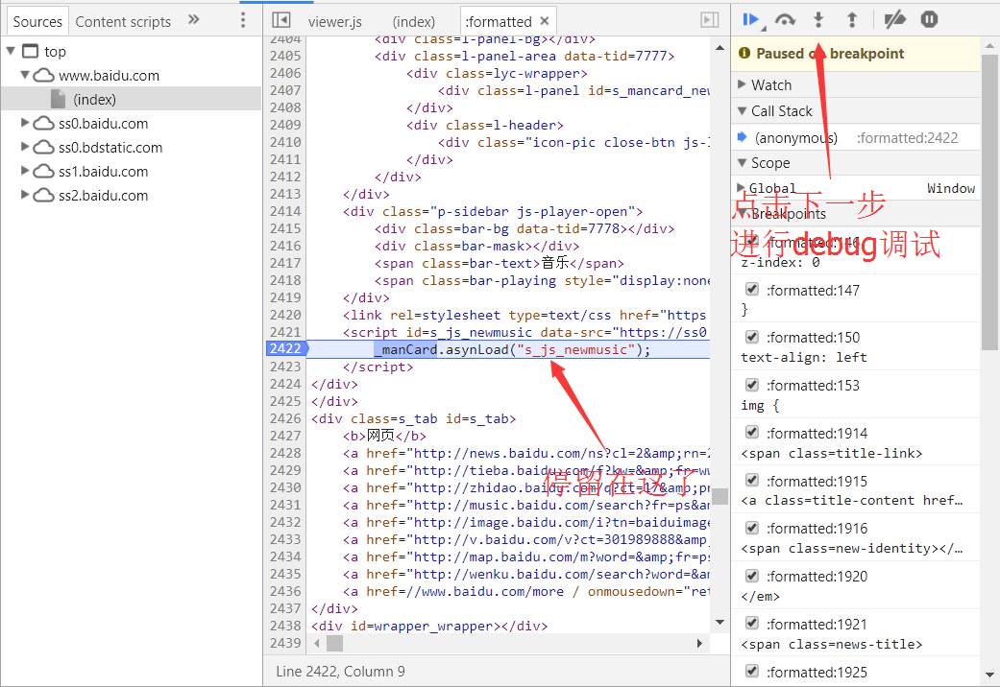

#### Console（控制台）面板

在开发期间，可以使用控制台面板记录诊断信息，或者使用它作为 shell在页面上与JavaScript交互。下面就是一些方法：

1.console.log

释义：向控制台输出普通信息

如果参数只是字符串：

    console.log("在控制台会输出普通信息");

如果有两个参数,第一个参数是加了%c(注意小写)的字符串,那么在控制台输出时就会按照第二个参数给出的样式输出(下面的info,error,warn都可以使用%c格式输出文字)

    console.log("%c这里会输出红色,20字号的文字","font-size:20px;color:red");

2.console.info

释义：向控制台输出提示信息

    console.info("这是一条提示信息");

3.console.error

释义：向控制台输出错误信息

    console.error("这是一条错误信息");

4.console.warn

释义：向控制台输出警示信息

    console.warn("这是一条警息");

5.console.group,console.groupEnd

console.group：开始一组输出信息,可以嵌套,形成子信息,要结束当前组的信息输出,要调用console.groupEnd
console.groupEnd：结束一组输出信息

    console.log("%ckitchen api","font-size:18px;color:red");
    console.group("vueComp方法");
    console.log("该方法是生成一个可装配的组件");
    console.group("参数(Object)");
    console.log("path:载入组件的路径");
    console.log("cache:是否开启缓存")
    console.groupEnd();
    console.groupEnd();

6.console.table

释义：以表格形式将数据输出

    var data = [
    {"name":"尼古拉斯.赵四","age":32},
    {"name":"岳云鹏","age":"32"}
    ];
    console.table(data);

7.console.assert

释义：断言

    var isDebug = false;
    console.assert(isDebug,"如果前一个参数是false,控制台将输出这段话")

如果第一个参数不是布尔型,会自动转成布尔型(0,false,"",null,undefined,NaN转为false,其他均为true),不过建议直接写false或者true

8.console.count

释义：统计某个代码片段执行了多少次

    function runCount () {
    //…代码逻辑
    console.count("runCount执行次数:")}
    runCount();
    runCount();
    runCount();
    runCount();

9.console.dir

释义：将传入对象的属性,包括子对象的属性,以列表形式输出:

    var obj = { name : "li4065", sex : "man", age : 29}
    console.dir(obj);
    console.dir(document.body); //以列表形式,把body的相关属性展示出

PS.另外还有个console.dirxml方法,是会把相关节点中的包含的html/xml输出,感觉没啥用。不如直接在控制台输入某个节点,会直接把该节点html/xml输出。

10.console.time,console.timeEnd

console.time：生成一个记时器,并开始记时
console.timeEnd：结束某个指定标示的记时两者配套使用,会把指定计时器运行时间计算出来

    console.time("run"); //生成一个名为run的定时器
    for(var i=0;i<1000;i++) { console.log("ces")};
    console.timeEnd("run"); //结束名为run的定时器在chrome浏览器下
    会输出:run: 96.274ms

11.console.profile,console.profileEnd

console.profile：标记一个性能记录点,并开始进行性能记录
console.profileEnd：结束某个性能记录可以在浏览器的profile的标签看到相关性能记录情况(记录名,就是profile中的名称)

    function sayHi() { for(var i=0;i<1000;i++){ console.log("hi") }}
    console.profile("记录sayHi的性能");
    sayHi();
    console.profileEnd("记录sayHi的性能");

记录性能除了可以用这种手写方式,也可以通过在profile标签下,进行操作来记录

12.console.trace

释义：追逐函数的调用过程(堆栈跟踪相关的调试)

    function testTrace () {
    var a = 12;
    submit(a);
    }
    function submit (a) {
    var b = 23;
    add(a,b);
    }
    function add (a,b) {
    console.log(a + b);
    console.trace("追踪add相关的调用函数"); //如果这里不传值,控制台会把console.trace()当作记录的堆栈名}

13.在chrome控制台下,除了以上的相关方法,还有如下两个比较好用的方法：keys,values

keys：返回传入对象所有属性名组成的数据.
values：返回所有属性值组成的数组.

    var info={name:’li4065’,sex:’man’,age:’29’};
    keys(info); //把info存起来
    values(info); //获取info的相关数据

14.monitor,unmonitor

monitor：接收某个函数作为参数,该函数只要一执行,控制台就会输出相关信息
unmonitor：移除对某个函数的监听

    function sayHi () {
    console.log("Hi");
    }
    monitor(sayHi);
    sayHi();
    unmonitor(sayHi);
    sayHi();
