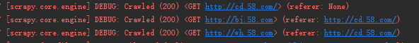
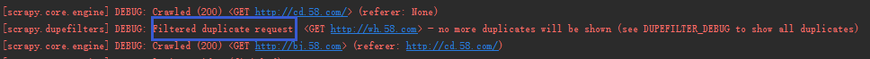
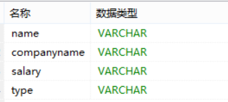
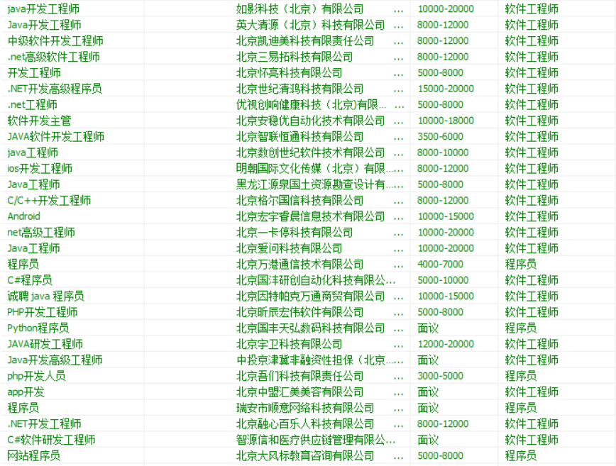

# 爬虫工程师进阶（八）：去重与入库

数据去重又称重复数据删除，是指在一个数字文件集合中，找出重复的数据并将其删除，只保存唯一的数据单元。数据去重可以有效避免资源的浪费，所以数据去重至关重要。

数据去重可以从两个节点入手：一个是URL去重。即直接筛选掉重复的URL；另一个是数据库去重。即利用数据库的一些特性筛选重复的数据。

## URL去重

### 为什么需要进行URL去重？

1. 在爬虫启动工作的过程中，我们不希望同一个网页被多次下载，因为重复下载不仅会浪费CPU机时，还会为搜索引擎系统增加负荷。而想要控制这种重复性下载问题，就要考虑下载所依据的超链接，只要能够控制待下载的URL不重复，基本可以解决同一个网页重复下载的问题。
2. 对于已经抓取过的链接，进行持久化，并且在启动的时候加载进入去重队列，是一个比较强的需求。它主要应对爬虫故障重跑，不需要重跑所有链接

### 如何确定去重强度？

根据爬取周期确定使用去重强度

1. 抓取周期在一个小时内，不需要对已经抓取的链接做持久化
2. 抓取周期在一天内（或抓取的数据总量30w以下），需要对抓取链接做一个相对简单的持久化
3. 抓取周期在一天以上，需要对抓取链接做相对专业的持久化

### URL去重方法：两种解决方法

已经造好的轮子系列：

- scrapy-deltafetch
- scrapy-crawl-once
- scrapy-redis
- scrapy-redis-bloomfilter

自己造轮子：

- 自己写的init_add_request方法, 可以轻量实现

### 已经造好的轮子：[scrapy-deltafetch](https://github.com/scrapy-plugins/scrapy-deltafetch)

scrapy-deltafetch通过[Berkeley DB](https://static.dcxueyuan.com/content/disk/train/other/bf0f7ad8-fcbc-430d-b07d-1d2f21c45f7e.html#jump1)来记录爬虫每次爬取收集的request和item，当重复执行爬虫时只爬取新的item，实现增量去重，提高爬虫爬取性能。

scrapy-deltafetch是依赖于Berkeley DB的，所以必须先安装bsddb3。选择使用[LFD](http://www.lfd.uci.edu/~gohlke/pythonlibs)，这个网址包含几乎所有在Windows上安装容易出错的库，使用命令pip install 文件路径+文件名。

安装

    pip install scrapy-deltafetch

配置

settings.py文件中爬虫中间件部分添加DeltaFetch middleware

    SPIDER_MIDDLEWARES = {
    ‘scrapy_deltafetch.DeltaFetch’: 100,
    }

这里，优先级100只是一个例子。设置它的值取决于其他中间件的优先级。

为了让DeltaFetch可以使用，要在settings.py文件中把DELTAFETCH_ENABLED设为TRUE，

    DELTAFETCH_ENABLED = True

参数设置：

- DELTAFETCH_ENABLED— 是否启用这个扩展件
- DELTAFETCH_DIR— 存储状态目录
- DELTAFETCH_RESET — 重置数据库，清除数据库所有请求

核心代码：

```python
  def process_spider_output(self, response, result, spider):
    for r in result:  
        if isinstance(r, Request):    #对结果进行分析，如果是url，继续下一步，否则跳过
            key = self._get_key(r)    #通过_get_key函数生成key
            if key in self.db:        #查看key是否在数据库中
                logger.info("Ignoring already visited: %s" % r)   #如果在数据库，就抛弃
                if self.stats:
                    self.stats.inc_value('deltafetch/skipped', spider=spider)
                continue
        elif isinstance(r, (BaseItem, dict)):   #对结果分析，如果是dict or item ，继续下一步
            key = self._get_key(response.request)   
            self.db[key] = str(time.time())     #对url进行持久化操作
            if self.stats:
                self.stats.inc_value('deltafetch/stored', spider=spider)
        yield r
 def _get_key(self, request):
        #key值的生成，要么是request.meta传过来，要么使用指纹算法生成
        key = request.meta.get('deltafetch_key') or request_fingerprint(request)

        return to_bytes(key)  
```

### scrapy原去重方法

这个处理的代码是编写在 `dupefilter.py` 文件中的，其中定义了处理重复 url 的方法。

具体步骤如下：

1. 通过RFPDupeFilter() 类初始化一个名为fingerprints的set()集合
2. 当request传入进来，通过指纹计算（也就是用请求方式和url对其进行哈希），得到唯一key值
3. 在已抓取 url 集合中查找，如果不存在，就添加进去，如果需要写入文件，就写入文件；如果已经存在了，告诉上层调用 url 已经抓取过了。

主要代码如下：

```python
def request_seen(self, request):
        fp = self.request_fingerprint(request)  #指纹计算，得到唯一key值
        if fp in self.fingerprints:   #在已抓取 url 集合中查找，如果不存在，就添加进去，如果需要写入文件，就写入文件；如果已经存在了，告诉上层调用 url 已经抓取过了。
            return True
        self.fingerprints.add(fp)
        if self.file:
            self.file.write(fp + os.linesep)
```

弊端：

1. 如果该函数在下载器之前被调用，没办法保证目标url是否下载成功，如果失败了，没办法重复下载重试。（经过验证scrapy使用的是这种调用方式）
scrapy框架的解决办法：在request中把dont_filter参数设为True
2. 如果该函数在下载器之后被调用，没起到url去重应有的作用，依然浪费了资源。

init_add_request方法

```python
from scrapy.http import Request
def init_add_request(spider, url):
    """
    此方法用于在，scrapy启动的时候添加一些已经跑过的url，让爬虫不需要重复跑

    """
    rf = spider.crawler.engine.slot.scheduler.df  #找到实例化对象

    request = Request(url)
    rf.request_seen(request)    #调用request_seen方法
```

演示示例

这次示例先使用没有添加去重机制的爬虫进行试验，再添加去重机制看看两者的区别。

```python
import scrapy
from scrapy.http import Request

class SpiderCity58Spider(scrapy.Spider):
    name = 'spider_city_58'
    allowed_domains = ['58.com']
    start_urls = ['http://cd.58.com/']

    def parse(self, response):
        pass
        yield Request('http://bj.58.com' , callback = self.parse) #请求bj.58.com，并回调parse函数
        yield Request('http://wh.58.com' , callback=self.parse)  #请求wh.58.com，并回调parse函数
```

得到结果如下：



可以看到三个链接都可以正常爬取，返回码为200

在scrapy文件夹下，建立去重文件`init_utils.py`：

```python
from scrapy.http import Request
def init_add_request(spider, url):
    """
    此方法用于在，scrapy启动的时候添加一些已经跑过的url，让爬虫不需要重复跑

    """
    rf = spider.crawler.engine.slot.scheduler.df  #找到实例化对象

    request = Request(url)
    rf.request_seen(request)    #调用request_seen方法
```

在pipelines中添加去重函数：

    def open_spider(self,spider):
    init_add_request(spider, ‘http://wh.58.com‘)

改变settings参数：

    ITEM_PIPELINES = {
    'city_58.pipelines.City58Pipeline': 300,
    }

可以得到结果：



### 已经造好的轮子：[scrapy-redis](https://github.com/rmax/scrapy-redis)

#### scrapy-redis是什么？

scrapy-redis：一个三方的基于redis的分布式爬虫框架，配合scrapy使用，让爬虫具有了分布式爬取的功能

#### scrapy-redis的原理

scrapy-redis实现分布式，其实从原理上来说很简单，这里为描述方便，我们把自己的核心服务器称为master，而把用于跑爬虫程序的机器称为slave。
我们在master上搭建一个redis数据库（注意这个数据库只用作url的存储，不关心爬取的具体数据，不要和后面的mongodb或者mysql混淆），并对每一个需要爬取的网站类型，都开辟一个单独的列表字段。通过设置slave上scrapy-redis获取url的地址为master地址。这样的结果就是，尽管有多个slave，然而大家获取url的地方只有一个，那就是服务器master上的redis数据库。
并且，由于scrapy-redis自身的队列机制，slave获取的链接不会相互冲突。这样各个slave在完成抓取任务之后，再把获取的结果汇总到服务器上（这时的数据存储不再在是redis，而是mongodb或者 mysql等存放具体内容的数据库了）
这种方法的好处就是程序移植性强，只要处理好路径问题，把slave上的程序移植到另一台机器上运行，基本上就是复制粘贴的事情。

## 数据库去重

理论上讲，我们应该优先对url链接去重，数据库去重是一个很牵强的方案数据库去重，应该尽量使用数据库本身的各种机制去去重，如唯一键

数据入库

优先选择非关系数据库MongoDB，详情请见2-4课后资料

## 课后资料

自行了解，如何入库到MySQL

## 补充资料

### Berkeley DB数据库

[Berkeley DB简介](http://www.oracle.com/technetwork/database/database-technologies/berkeleydb/downloads/index.html)

Berkeley DB是一个嵌入式数据库，为应用程序提供可伸缩的、高性能的、有事务保护功能的数据管理服务。

主要特点：

1. 嵌入式：直接链接到应用程序中，与应用程序运行于同样的地址空间中，因此，无论是在网络上不同计算机之间还是在同一台计算机的不同进程之间，数据库操作并不要求进程间通讯。 Berkeley DB为多种编程语言提供了API接口，其中包括C、C++、Java、Perl、Tcl、Python和PHP，所有的数据库操作都在程序库内部发生。多个进程，或者同一进程的多个线程可同时使用数据库，有如各自单独使用，底层的服务如加锁、事务日志、共享缓冲区管理、内存管理等等都由程序库透明地执行。
2. 轻便灵活：可以运行于几乎所有的UNIX和Linux系统及其变种系统、Windows操作系统以及多种嵌入式实时操作系统之下，已经被好多高端的因特网服务器、台式机、掌上电脑、机顶盒、网络交换机以及其他一些应用领域所采用。一旦Berkeley DB被链接到应用程序中，终端用户一般根本感觉不到有一个数据库系统存在。
3. 可伸缩：Database library本身是很精简的（少于300KB的文本空间），但它能够管理规模高达256TB的数据库。它支持高并发度，成千上万个用户可同时操纵同一个数据库

### 数据入库到MySQL

这次爬取的对象是58同城，作为实例只是爬取了北京程序员的招聘信息。
首先在mysql中初始化一个表，用来存储数据



item.py：需要爬取的数据列表

```python
import scrapy


class E58TongchengItem(scrapy.Item):
    name = scrapy.Field()
    companyname = scrapy.Field()
    salary = scrapy.Field()
    type = scrapy.Field()
```

a58tongchengSpider.py：爬取网页的具体操作

```python
import scrapy
from scrapy.selector import Selector
from ..items import E58TongchengItem

class A58tongchengSpider(scrapy.Spider):
    name = '58tongcheng'
    allowed_domains = ['www.58.com']
    start_urls = ['http://zp.58.com/bailing/bj/tech/pn1?&ClickID=7']

    def parse(self, response):
        item = E58TongchengItem()
        try:
            selector = Selector(text=response.body)
        except Exception as e:
            print(e)
        name_hrefse = selector.xpath('//*[@id="list_con"]/li')
        for se in name_hrefse:
            #使用xpath提取数据
            item['name'] = se.xpath('div[1]/div[1]/a/span[2]/text()').extract()[0]
            item['companyname'] = se.xpath('div[2]/div/a/text()').extract()[0]
            item['salary'] = se.xpath('div[1]/p/text()').extract()[0]
            item['type'] = se.xpath('div[2]/p/span[1]/text()').extract()[0]

            yield item
```

E58TongchengPipeline.py：保存在mysql中

```python
import pymysql
class E58TongchengPipeline(object):
    def process_item(self, item, spider):
        # 打开数据库连接
        db = pymysql.connect("localhost", "root", "", "test", charset="utf8")
        # 使用 cursor() 方法创建一个游标对象 cursor
        cursor = db.cursor()
        #插入数据库
        cursor.execute("insert into test(name,companyname,salary,type)values(%s,%s,%s,%s)",[item['name'],item['companyname'],item['salary'],item['type']])
        #提交
        db.commit()
        cursor.close()
        db.close()
        print(item)
        return item
```

最后使用命令启动

    scrapy crawl 58tongcheng

最后得到结果：


