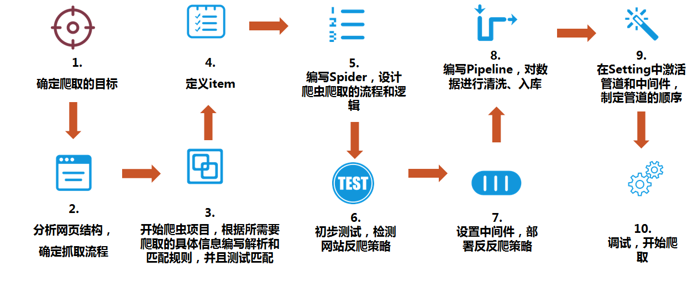
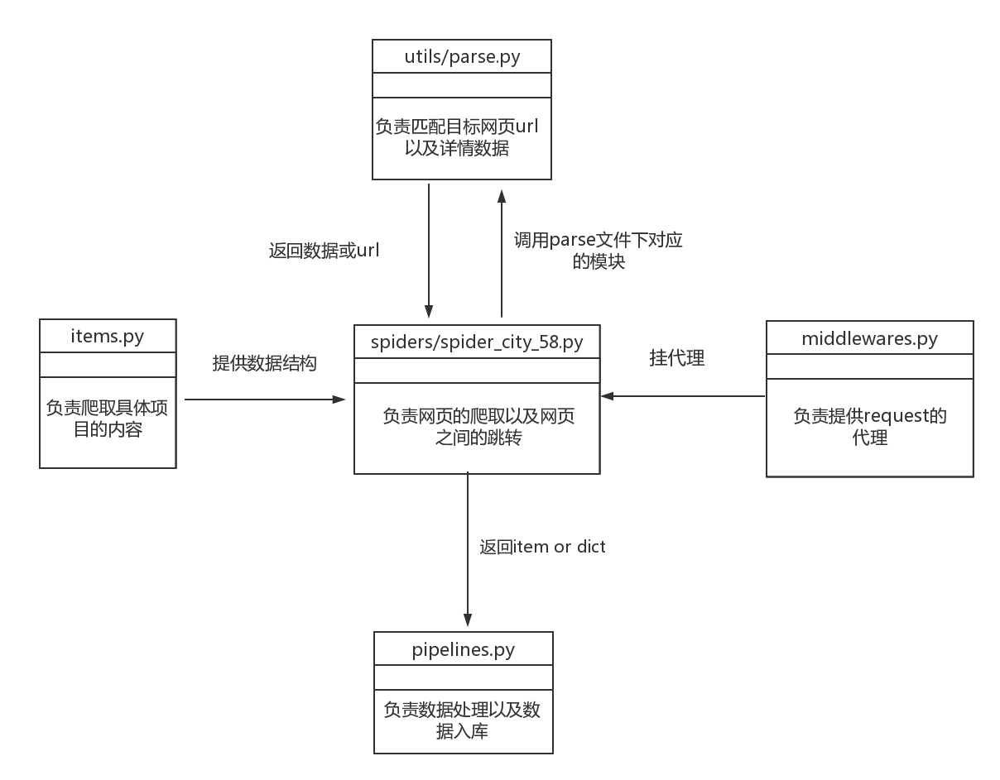

## 实训项目（一）——58同城出租信息抓取（上）

本节课将利用前面学习的基础知识，实现58同城出租信息抓取。

### 爬虫整体流程



### 58同城抓取流程

1. 进入[成都小区页面](http://cd.58.com/xiaoqu/)，确定抓取目标 
2. 观察页面，获取各行政区的链接 
3. 分行政区抓取各小区的URL 
4. 进入各小区[详情页面](http://cd.58.com/xiaoqu/shenxianshudayuan/)，抓取名字、价格、地址、年份等信息 
5. 抓取[小区二手房页面](http://cd.58.com/xiaoqu/shenxianshudayuan/ershoufang/)第一页的价格，在管道中求该小区房价的平均价格 
6. 抓取小区[出租房页面](http://cd.58.com/xiaoqu/shenxianshudayuan/chuzu/)第一页的URL，进入详情页抓取名称、价格、房型等信息

需要抓取的有：

- 各行政区下的小区列表的小区URL
- 小区详情页中该小区的名字、价格、地址、年份等信息
- 各小区二手房页面的二手房每平米价格，并在管道中计算出小区真实平均房价
- 各小区租房页面列表中每个租房房源的URL
- 每个租房房源的详情页中，该房源的名称、价格、房型等信息

### 58同城抓取代码模块示意图：



### 代码：

1. 创建scrapy文件，命名为city_58，并创建爬虫文件spider_city_58

        >>> scrapy startproject city_58 
        >>> cd city_58 
        >>> scrapy genspider spider_city_58 58.com

2. 编写items.py文件，这个文件主要负责定义具体项目的内容 

```python
import scrapy


class City58Item(scrapy.Item):
    # define the fields for your item here like:
    name = scrapy.Field()
    price = scrapy.Field()
    last_updated = scrapy.Field()


class City58ItemXiaoQu(scrapy.Item):
    id = scrapy.Field()
    name = scrapy.Field()
    reference_price = scrapy.Field()
    address = scrapy.Field()
    times = scrapy.Field()


class City58ItemXiaoChuZuQuInfo(scrapy.Item):
    id = scrapy.Field()  
    name = scrapy.Field()
    zu_price = scrapy.Field()
    type = scrapy.Field()
    mianji = scrapy.Field()
    chuzu_price_pre = scrapy.Field()
    url = scrapy.Field()
    price_pre = scrapy.Field()
```

3. 在city_58文件夹下创建utils文件夹，文件夹下创建一个parse.py文件，parse.py共有5个函数，分别负责匹配列表页所有的小区url，小区的详情页信息，二手房的详情页信息，出租页面详情页的url，出租页面详情页 

```python
# code:utf8
from pyquery import PyQuery


def parse(response):
    """
    抓取小区列表页面： http://cd.58.com/xiaoqu/11487/
    返回列表页所有的小区url
    :param:response
    :return
    """
    jpy = PyQuery(response.text)

    tr_list = jpy('#infolist > div.listwrap > table > tbody > tr').items()

    result = set()  #result为set集合（不允许重复元素）
    for tr in tr_list:
        url = tr(' td.info > ul > li.tli1 > a').attr('href')  #爬取各个小区的url
        result.add(url)

    return result


def xiaoqu_parse(response):
    """
    小区详情页匹配代码样例url:http://cd.58.com/xiaoqu/shenxianshudayuan/
    返回这个小区的详细信息的dict字典，主要信息包括小区名称，小区参考房价，小区地址，小区建筑年代
    :param:response
    :return:
    """

    result = dict()
    jpy = PyQuery(response.text)
    result['name'] = jpy('body > div.bodyItem.bheader > div > h1 > span').text()
    result['reference_price'] = jpy('body > div.bodyItem.bheader > div > dl > dd:nth-child(1) > span.moneyColor').text()
    result['address'] = jpy('body > div.bodyItem.bheader > div > dl > dd:nth-child(3) > span.ddinfo')\
        .text().replace('查看地图', '')   #得到地址详情，去除“查看地图”，如 “ 紫荆西路6号 查看地图”，将“查看地图”替换为“”
    result['times'] = jpy('body > div.bodyItem.bheader > div > dl > dd:nth-child(5)').text().split()
    result['times'] = result['times'][2]  #取出建筑年代
    return result


def get_ershou_price_list(response):
    """
    页面链接样例:http://cd.58.com/xiaoqu/shenxianshudayuan/ershoufang/
    匹配二手房列表页面的所有房价信息
    返回一个价格的列表list
    :param:response
    :return:
    """

    jpy = PyQuery(response.text)
    price_tag = jpy('td.tc > span:nth-child(3)').text().split()
    price_tag = [i[:-3] for i in price_tag]   #遍历price_tag截取到倒数第三个元素
    return price_tag


def chuzu_list_pag_get_detail_url(response):
    """
    页面链接样例:http://cd.58.com/xiaoqu/shenxianshudayuan/chuzu/
    获取出租列表页所有详情页url
    返回一个url的列表list
    :param:response
    :return:
    """
    jpy = PyQuery(response.text)
    a_list = jpy('tr > td.t > a.t').items()
    url_list = [a.attr('href') for a in a_list]  #遍历a_list
    return url_list


def get_chuzu_house_info(response):
    """
    获取出租详情页的相关信息
    返回一个dict包含：出租页标题，出租价格，房屋面积，房屋类型（几室几厅）
    :param:response
    :return:
    """
    jpy = PyQuery(response.text)
    result = dict()
    result['name'] = jpy('body > div.main-wrap > div.house-title > h1').text()
    result['zu_price'] = jpy('body > div.main-wrap > div.house-basic-info > div.house-basic-right.fr > '
                          'div.house-basic-desc > div.house-desc-item.fl.c_333 > div > span.c_ff552e > b').text()

    result['type'] = jpy('body > div.main-wrap > div.house-basic-info > div.house-basic-right.fr > div.house-basic-desc'
                         ' > div.house-desc-item.fl.c_333 > ul > li:nth-child(2) > span:nth-child(2)').text()

    result['type'], result['mianji'], *_ = result['type'].split()
    return result


if __name__ == '__main__':
    import requests
    r = requests.get('http://cd.58.com/zufang/31995551807162x.shtml')
    get_chuzu_house_info(r)
```

4. 编写spider_city_58.py，这个文件主要负责网页的爬取以及网页之间的跳转 

```python
# -*- coding: utf-8 -*-
import scrapy    #导入scrapy包
from scrapy.http import Request  #导入Request包
from ..utils.parse import parse, \    #从utils文件夹中导入parse文件中的这些类
    xiaoqu_parse, get_ershou_price_list, \
    chuzu_list_pag_get_detail_url,\
    get_chuzu_house_info
from ..items import City58ItemXiaoQu, City58ItemXiaoChuZuQuInfo  #从items文件导入这些类

from traceback import format_exc


class SpiderCity58Spider(scrapy.Spider):
    name = 'spider_city_58'
    allowed_domains = ['58.com']
    host = 'cd.58.com'
    xianqu_url_format = 'http://{}/xiaoqu/{}/'
    # xianqu_code = list()
    xianqu_code = list(range(103, 118))
    xianqu_code.append(21611)

    def start_requests(self):   #重写start_requests函数
        start_urls = ['http://{}/xiaoqu/{}/'.format(self.host, code) for code in self.xianqu_code]    
        for url in start_urls:
            yield Request(url)    #遍历所有区域

    def parse(self, response):

        """
        第一步抓取所有的小区
        http://cd.58.com/xiaoqu/21611/
        :param response:
        :return:
        """

        url_list = parse(response)   #调用utils文件夹中parse文件中的parse方法，得到所有小区的url

        for url in url_list:
            yield Request(url,
                          callback=self.xiaoqu_detail_pag,   #回调xiaoqu_detail_pag方法
                          errback=self.error_back,
                          priority=4
                          )


    def xiaoqu_detail_pag(self, response):

        """
        第二步抓取小区详情页信息
        http://cd.58.com/xiaoqu/shenxianshudayuan/
        :param response:
        :return:
        """

        _ = self
        data = xiaoqu_parse(response)
        item = City58ItemXiaoQu()
        item.update(data)
        item['id'] = response.url.split('/')[4]
        yield item

        # 二手房
        url = 'http://{}/xiaoqu/{}/ershoufang/'.format(self.host, item['id'])
        yield Request(url,
                      callback=self.ershoufang_list_pag,  #回调ershoufang_list_pag方法
                      errback=self.error_back,
                      meta={'id': item['id']},
                      priority=3)

        # 出租房
        url_ = 'http://{}/xiaoqu/{}/chuzu/'.format(self.host, item['id'])

        yield Request(url_,
                      callback=self.chuzu_list_pag,  #回调chuzu_list_pag方法
                      errback=self.error_back,
                      meta={'id': item['id']},
                      priority=2)

    def ershoufang_list_pag(self, response):

        """
        第三步抓取二手房详情页信息
        http://cd.58.com/xiaoqu/shenxianshudayuan/ershoufang/
        :param response:
        :return:
        """

        _ = self
        price_list = get_ershou_price_list(response)

        yield {'id': response.meta['id'], 'price_list': price_list}


    def chuzu_list_pag(self, response):

        """
        第四步抓取出租房详情页url
        http://cd.58.com/xiaoqu/shenxianshudayuan/chuzu/
        :param response:
        :return:
        """

        _ = self
        url_list = chuzu_list_pag_get_detail_url(response)

        for url in url_list:
            yield response.request.replace(url=url, callback=self.chuzu_detail_pag, priority=1)  #回调chuzu_detail_pag方法
            # yield Request(url, callback=)

    def chuzu_detail_pag(self, response):

        """
        第五步抓取出租房详情页信息
        :param response:
        :return:
        """

        _ = self
        data = get_chuzu_house_info(response)
        item = City58ItemXiaoChuZuQuInfo()
        item.update(data)
        item['id'] = response.meta['id']
        item['url'] = response.url
        yield item

    def error_back(self, e):
        _ = e
        self.logger.error(format_exc())  #打出报错信息
```

### 小结

- 以上便是该项目的匹配代码以及抓取流程，建议大家先把前面所讲授的Scrapy基础知识学通，把Python基础打好，再开始服用本节课程
- 本节课程看似复杂，其实涉及的知识都是之前已经学习过的，大家不必太过慌张。建议先把整体爬取流程理通，再跟着老师的思路理清每部分代码的作用
- 下节课的主要内容是管道的数据处理和入库以及在下载中间件中使用IP代理。下节更精彩，千万别走开