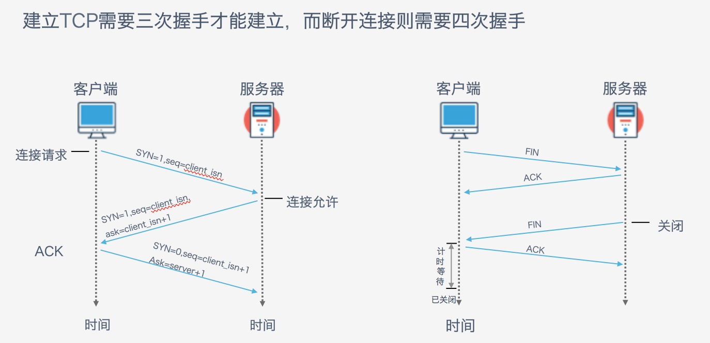

## 什么是爬虫

本节课程的内容是介绍什么是爬虫？爬虫有什么用？以及爬虫是如何实现的？从这三点来全面剖析爬虫这一工具。

### 爬虫的定义

网络爬虫（又被称为网页蜘蛛，网络机器人，在FOAF社区中间，更经常的称为网页追逐者），是一种按照一定的规则，自动地抓取万维网信息的程序或者脚本。

### 爬虫有什么用

- 市场分析：电商分析、商圈分析、一二级市场分析等
- 市场监控：电商、新闻、房源监控等
- 商机发现：招投标情报发现、客户资料发掘、企业客户发现等

### 认识网址的构成

一个网站的网址一般由域名+自己编写的页面所构成。我们在访问同一网站的网页时，域名一般是不会改变的，因此我们爬虫所需要解析的就是网站自己所编写的不同页面的入口url，只有解析出来各个页面的入口，我们才能开始我们的爬虫。

### 了解网页的两种加载方法

- 同步加载：改变网址上的某些参数会导致网页发生改变，例如：www.itjuzi.com/company?page=1（改变page=后面的数字，网页会发生改变）
- 异步加载：改变网址上的参数不会使网页发生改变，例如：www.lagou.com/gongsi/（翻页后网址不会发生变化）

### 认识网页源码的构成

在网页中右键点击查看网页源码，可以查看到网页的源代码信息。 
源代码一般由三个部分组成，分别是：

1. html：描述网页的内容结构
2. css：描述网页的排版布局
3. JavaScript：描述网页的事件处理，即鼠标或键盘在网页元素上的动作后的程序 

这里给出了三者的扩展知识的链接，需要大家重点关注html的构成，然后稍微了解下css和JavaScript在网页构成中的作用即可。

### 查看网页请求

以chrome浏览器为例，在网页上点击鼠标右键，检查（或者直接F12），选择network，刷新页面，选择ALL下面的第一个链接，这样就可以看到网页的各种请求信息。

请求头（Request Headers）信息详解：

```
Accept: text/html,image/*(浏览器可以接收的类型)
Accept-Charset: ISO-8859-1(浏览器可以接收的编码类型)
Accept-Encoding: gzip,compress(浏览器可以接收压缩编码类型)
Accept-Language: en-us,zh-cn(浏览器可以接收的语言和国家类型)
Host: www.it315.org:80(浏览器请求的主机和端口)
If-Modified-Since: Tue, 11 Jul 2000 18:23:51 GMT(某个页面缓存时间)
Referer: http://www.it315.org/index.jsp(请求来自于哪个页面)
User-Agent: Mozilla/4.0 (compatible; MSIE 5.5; Windows NT 5.0)(浏览器相关信息)
Cookie：(浏览器暂存服务器发送的信息)
Connection: close(1.0)/Keep-Alive(1.1)(HTTP请求的版本的特点)
Date: Tue, 11 Jul 2000 18:23:51 GMT(请求网站的时间)
```

响应头（Response Headers）信息详解：

```
Location: http://www.it315.org/index.jsp(控制浏览器显示哪个页面)
Server:apache tomcat(服务器的类型)
Content-Encoding: gzip(服务器发送的压缩编码方式)
Content-Length: 80(服务器发送显示的字节码长度)
Content-Language: zh-cn(服务器发送内容的语言和国家名)
Content-Type: image/jpeg; charset=UTF-8(服务器发送内容的类型和编码类型)
Last-Modified: Tue, 11 Jul 2000 18:23:51 GMT(服务器最后一次修改的时间)
Refresh: 1;url=http://www.it315.org(控制浏览器1秒钟后转发URL所指向的页面)
Content-Disposition: attachment; filename=aaa.jpg(服务器控制浏览器发下载方式打开文件)
Transfer-Encoding: chunked(服务器分块传递数据到客户端） 
Set-Cookie:SS=Q0=5Lb_nQ; path=/search(服务器发送Cookie相关的信息)
Expires: -1(服务器控制浏览器不要缓存网页，默认是缓存)
Cache-Control: no-cache(服务器控制浏览器不要缓存网页)
Pragma: no-cache(服务器控制浏览器不要缓存网页)  
Connection: close/Keep-Alive(HTTP请求的版本的特点)  
Date: Tue, 11 Jul 2000 18:23:51 GMT(响应网站的时间)
```

### 理解网页请求过程

从浏览器输入网址、回车后，到用户看到网页内容，经过的步骤如下：

（1）dns解析，获取ip地址；

（2）建立TCP连接，3次握手；

（3）发送HTTP请求报文；

（4）服务器接收请求并作处理；

（5）服务器发送HTTP响应报文；

（6）断开TCP连接，4次握手。



这里需要大家回忆起计算机网络中学到的相关知识，主要是http请求的相关内容，重点了解下TCP三次握手的一个流程，阅读[网页http请求的整个过程](http://blog.csdn.net/allenjay11/article/details/51788026)，理解下网页的请求过程。

### 通用的网络爬虫框架

1. 挑选种子URL；
2. 将这些URL放入待抓取的URL队列；
3. 取出待抓取的URL，下载并存储进已下载网页库中。此外，将这些URL放入待抓取URL队列，从而进入下一循环；
4. 分析已抓取队列中的URL，并且将URL放入待抓取URL队列，从而进入下一循环。


### 扩展阅读

利用爬虫技术能做到哪些很酷很有趣很有用的事情？
有这么一句话在业界广泛流传：巧妇难为无米之炊，我们要做大数据分析，要做机器学习模型训练，没有海量的数据是无法完成的。这些数据都是哪来的？其中当然有一部分是企业收集整理好的，但更多的还是需要自己来收集。那么这个时候就需要爬虫登场了。因此，爬虫在这个信息爆炸的大数据时代是一项必不可少的技能。 
阅读[利用爬虫技术能做到哪些很酷很有趣很有用的事情？](https://www.zhihu.com/question/27621722)，看看爬虫还能干哪些你想不到的事情。