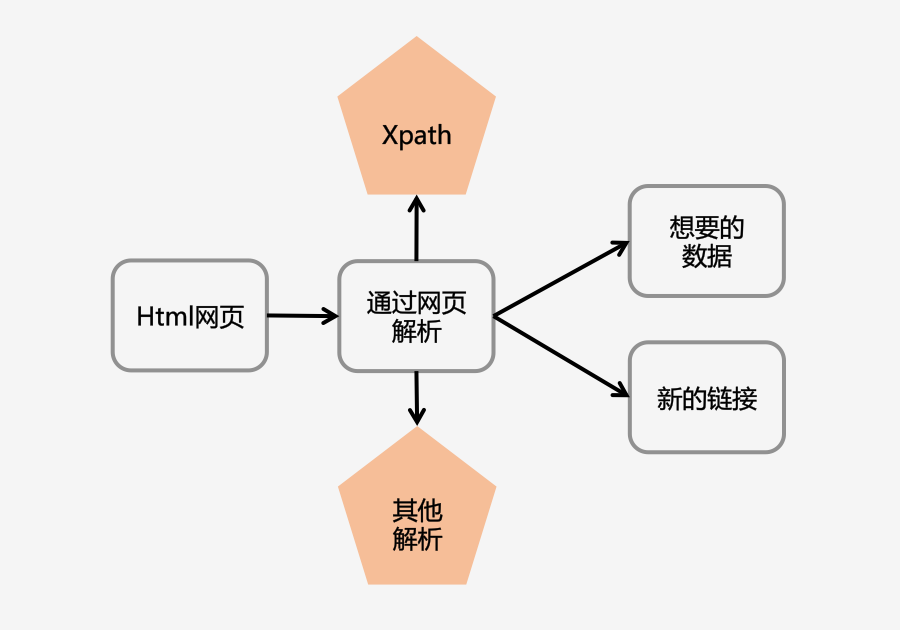
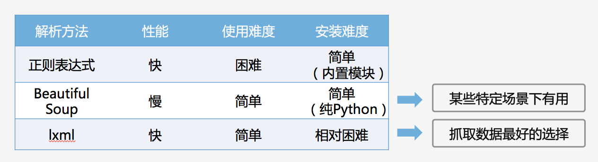
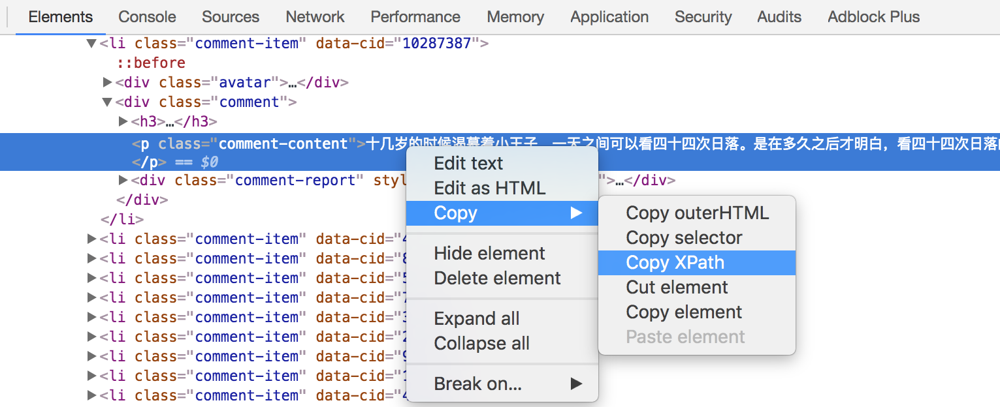
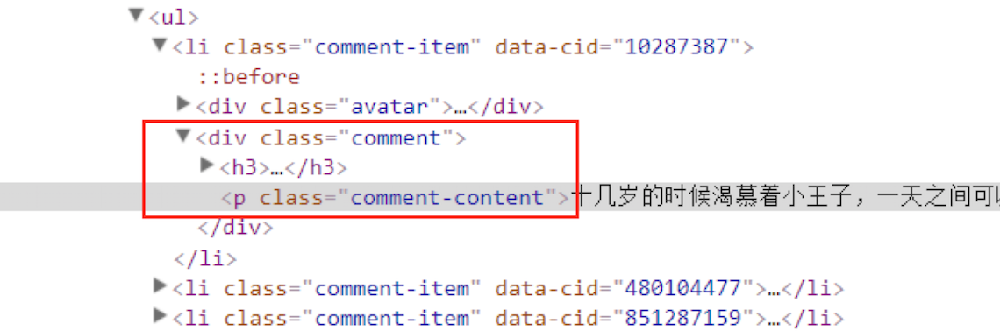
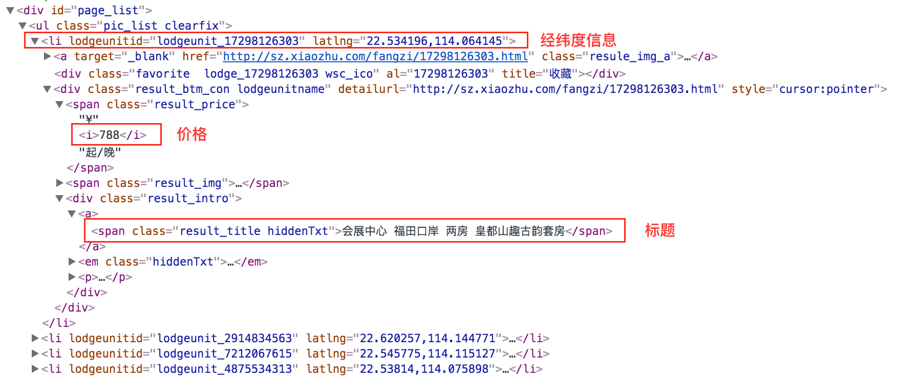

## 使用Xpath解析豆瓣短评

本节课程主要介绍解析神器Xpath是什么、Xpath如何安装及使用，以及使用实际的例子讲解Xpath如何解析豆瓣短评的网页并获取数据。

- 解析神器Xpath
- Xpath的使用
- 实战环节

### 解析神器Xpath：

1. 什么是Xpath

	XPath即为XML路径语言（XML Path Language），它是一种用来确定XML文档中某部分位置的语言。

	XPath基于XML的树状结构，提供在数据结构树中找寻节点的能力。起初XPath的提出的初衷是将其作为一个通用的、介于XPointer与XSL间的语法模型。但是XPath很快的被开发者采用来当作小型查询语言。

	可以阅读该[文档](http://www.w3school.com.cn/xpath/xpath_intro.asp)了解更多关于Xpath的知识。

	https://zhuanlan.zhihu.com/p/25572729

2. Xpath解析网页的流程

	1. 首先通过Requests库获取网页数据
	2. 通过网页解析，得到想要的数据或者新的链接
	3. 网页解析可以通过Xpath或者其它解析工具进行，Xpath在是一个非常好用的网页解析工具 




3. 常用的网页解析 



	- 正则表达式使用比较困难，学习成本较高
	- BeautifulSoup性能较慢，相对于Xpath较难，在某些特定场景下有用
	- Xpath使用简单，速度快（Xpath是lxml里面的一种），是抓取数据最好的选择

4. Xpath的安装

第一种方法：直接使用pip安装，直接在命令行输入以下代码

```pip install lxml```

第二种方法：使用下载whl文件方法安装（安装方法跟上节课安装Requests库方法相同），这种方法在直接使用pip安装不成功的情况下采用 
第一步前往http://www.lfd.uci.edu/~gohlke/pythonlibs/，手动下载需要安装的第三方包（注意对应你的python版本是32位还是64位）
然后在下载下来的文件所在目录按住shift并点击鼠标右键，选择在此处打开Powershell窗口，在此命令行中使用`pip install + 下载下来文件全名`，即可完成安装
检查安装：进入Python，输入import lxml导入新安装的lxml，如果没有返回错误便说明已安装成功

### Xpath的使用：

1. 使用Xpath解析网页数据的步骤

	- 从lxml导入etree
	- 解析数据，返回xml结构
	- 使用.xpath()寻找和定位数据

```
from lxml import etree

html ='''#省略'''#html数据，使用requests获取

s = etree.HTML(html)#解析html数据

print(s.xpath())#使用.xpath()
```

2. 获取Xpath的方法

第一种方法：从浏览器直接复制

	- 首先在浏览器上定位到需要爬取的数据
	- 右键，点击“检查”，在“Elements”下找到定位到所需数据
	- 右键——Copy——Copy Xpath，即可完成Xpath的复制

示例：


```
#从浏览器直接复制Xpath
import requests
from lxml import etree

url = 'https://book.douban.com/subject/1084336/comments/'
r = requests.get(url).text

s = etree.HTML(r)
print(s.xpath('//*[@id=“comments”]/ul/li[1]/div[2]/p/text()'))
```


- 获取文本内容用 text()
- 获取注释用 comment()
- 获取其它任何属性用@xx，如： @href @src @value
- 想要获取某个标签下所有的文本（包括子标签下的文本），使用string. 如”< p>123< a>来获取我啊< /a>< /p>”，这边如果想要得到的文本为”123来获取我啊”，则需要使用string
- starts-with 匹配字符串前面相等
- contains 匹配任何位置相等

示例：



```
#手写Xpath
import requests
from lxml import etree

url = 'https://book.douban.com/subject/1084336/comments/'
r = requests.get(url).text

s = etree.HTML(r)
print(s.xpath('//div[@class="comment"]/p/text()')[0])
```

### 实战环节

使用Xpath爬取豆瓣图书《小王子》短评网页

- 使用从浏览器复制Xpath的方法获取同一网页下不同短评的Xpath，通过对比发现其规律
- 对比从浏览器复制Xpath的方法跟手写Xpath的方法的不同点已经两种方法各自的应用场景

```
import requests
from lxml import etree

url = 'https://book.douban.com/subject/1084336/comments/'
r = requests.get(url).text

s = etree.HTML(r)
#从浏览器复制第一条评论的Xpath
print(s.xpath('//*[@id="comments"]/ul/li[1]/div[2]/p/text()'))
#从浏览器复制第二条评论的Xpath
print(s.xpath('//*[@id="comments"]/ul/li[2]/div[2]/p/text()'))
#从浏览器复制第三条评论的Xpath
print(s.xpath('//*[@id=“comments”]/ul/li[3]/div[2]/p/text()'))

#掌握规律，删除li[]的括号，获取全部短评
print(s.xpath('//*[@id=“comments”]/ul/li/div[2]/p/text()'))

#手写Xpath获取全部短评
print(s.xpath('//div[@class="comment"]/p/text()'))
```

- 通过对比可以发现从浏览器复制的Xpath中，“li[]”括号中的数字代表对应的第几条评论，直接删除括号，即可获取全部短评
- 对于结构清晰的html网页，可以直接手写Xpath，更加简洁且高效
- 对于结构复杂的html网页，可以通过浏览器复制的方式获取Xpath

### 课后作业

1. 安装lxml 
2. 使用Xpath解析豆瓣网页 
3. 勇敢尝试你想爬取的网站

A. 爬取知乎“Python”话题精华数据

```
import requests
url = 'https://www.zhihu.com/topic/19552832/top-answers'
r = requests.get(url).text
print(r)
```
- 尝试着使用前面所学习的方法获取知乎“Python”话题精华的网页并打印出来，看看会出现什么问题
- 由于知乎反爬虫的原因，以上代码会返回“500 Server Error”，具体的解决方法会在第六课学习到

B 爬取小猪短租（深圳）页面的数据

爬取小猪短租（深圳）页面的短租标题、价格和经纬度，如图： 


代码如下：

```
import requests
from lxml import etree
url = 'http://sz.xiaozhu.com/'
r = requests.get(url).text#使用requests获取数据
s = etree.HTML(r)#解析html数据
print(s.xpath('//*[@id="page_list"]/ul/li/div[2]/div/a/span/text()'))#打印短租标题
print(s.xpath('//*[@id="page_list"]/ul/li/div[2]/span[1]/i/text()'))#打印短租价格
print(s.xpath('//*[@id="page_list"]/ul/li/@latlng'))#打印短租经纬度
```

- 首先使用浏览器打开[小猪短租(深圳)](http://sz.xiaozhu.com/) 的页面，通过阻止JavaScript加载的方法确定网页的加载方式
- 可以发现，阻止JavaScript加载之后页面还是可以显示短租的标题、价格等数据
- 接下来便可以爬取这一部分可显示的数据，在此例子中，我们主要爬取单个页面中每条短租信息的标题、价格和经纬度

### 补充知识

Xpath教程

- 阅读[Xpath教程](http://www.w3school.com.cn/xpath/)，掌握Xpath的基本知识

Xpath的基本使用

- 阅读[爬虫入门到精通-网页的解析（xpath）](https://zhuanlan.zhihu.com/p/25572729)，参考Xpath的使用方法
- 阅读[Python爬虫利器三之Xpath语法与lxml库的用法](http://cuiqingcai.com/2621.html)，了解更多Xpath的使用方法示例

正则表达式

- 阅读[Python正则表达式](http://www.runoob.com/python/python-reg-expressions.html)，了解正则表达式及其基本的语法
- 阅读[爬虫入门到精通-网页的解析（正则）](https://zhuanlan.zhihu.com/p/25553356)，学习使用正则表达式匹配网页数据

BeautifulSoup

- 阅读[Beautiful Soup 中文教程](http://www.pythonclub.org/modules/beautifulsoup/start)，了解使用BeautifulSoup解析网页的方法
- 阅读[Beautiful Soup 4.2.0 文档](https://www.crummy.com/software/BeautifulSoup/bs4/doc.zh/)这篇BeautifulSoup的官方文档，了解其更加全面的用法
